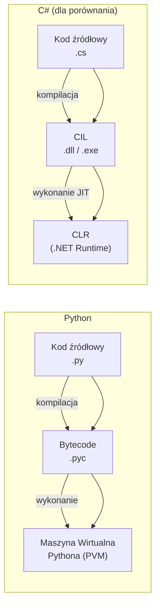
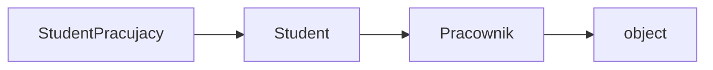

# 1. Filozofia i Podstawy: Zrozumienie "Dlaczego" w Pythonie

> [!TIP]
> Zrozumienie fundamentalnych różnic w filozofii projektowej między Pythonem a językami, które znasz, jest kluczem do szybkiego opanowania nowego narzędzia. Ta sekcja wyjaśnia, dlaczego pewne mechanizmy w Pythonie działają inaczej i jak wpływa to na codzienną pracę.

---

## Kluczowe Różnice Filozoficzne

Przejście z C++ czy C# na Pythona to przede wszystkim zmiana sposobu myślenia. C++ optymalizuje czas wykonania przez maszynę, dając programiście pełną kontrolę. Python optymalizuje czas pracy dewelopera, stawiając na czytelność i szybkość tworzenia oprogramowania.

### Język Interpretowany vs. Kompilowany: Prawda leży pośrodku

Określenie Pythona jako języka "interpretowanego" jest uproszczeniem. W rzeczywistości standardowa implementacja ([CPython](https://github.com/python/cpython)[^cpython]) najpierw **kompiluje** kod źródłowy `.py` do formy pośredniej zwanej **bytecode** i zapisuje go w plikach `.pyc`. Ten bytecode jest następnie wykonywany przez **Maszynę Wirtualną Pythona (PVM)**.

* **Proces ten jest analogiczny do kompilacji C# do CIL (Common Intermediate Language) i wykonywania go przez CLR (.NET Runtime)**.
* Pliki `.pyc` są tworzone automatycznie (w katalogu `__pycache__`), aby przyspieszyć ładowanie modułów przy kolejnych uruchomieniach.
* Główna różnica polega na tym, że cały proces jest ukryty i dzieje się w locie, co zapewnia błyskawiczny cykl deweloperski (edytuj -> uruchom) bez widocznego etapu kompilacji. Możemy też "na żywo" uruchamiać kod w interpreterze Python, co jest bardzo przydatne podczas debugowania.
* Konsekwencją jest to, że błędy typów są wykrywane dopiero w momencie wykonania danej linii kodu, a nie na etapie budowania projektu.



### Zarządzanie Pamięcią: Komfort i Bezpieczeństwo

To jedna z największych zmian podnoszących komfort pracy. W Pythonie zapominasz o manualnym zarządzaniu pamięcią – nie ma tu wskaźników, `new`/`delete` ani `malloc`/`free`.

* Główny mechanizm to **zliczanie referencji (reference counting)**. Każdy obiekt w pamięci ma licznik, który śledzi, ile zmiennych (nazw) na niego wskazuje. Gdy licznik spada do zera, obiekt jest usuwany.
* Dodatkowo **Garbage Collector (GC)** posiada mechanizmy do wykrywania i usuwania cyklicznych odwołań, z którymi sam licznik referencji by sobie nie poradził.
* Dla dewelopera oznacza to koniec zmartwień o wycieki pamięci (`memory leaks`) czy wiszące wskaźniki (`dangling pointers`), co eliminuje całą klasę trudnych błędów.
* Ceną za tę wygodę jest pewien narzut wydajnościowy i mniejsza kontrola nad układem danych w pamięci.

> [!NOTE]
> **Która to wersja Pythona?** Stan na maj 2026: aktualną serią rozwojową jest **Python 3.14** (wydanie 3.14.0 ukazało się 7 października 2025). Równolegle serwisowana jest seria **3.13**, a kolejne wydanie - **3.15** - planowane jest na październik 2026. Dla nowych projektów wybieraj 3.13 lub 3.14; unikaj wersji starszych niż 3.10, które nie otrzymują już pełnego wsparcia.

### GIL i free-threading: koniec ery jednego wątku

To zagadnienie zaskakuje deweloperów przychodzących z C++, C# czy Javy, gdzie prawdziwa, równoległa wielowątkowość jest oczywistością.

* Historycznie CPython chroniony był przez **GIL (Global Interpreter Lock)** - globalną blokadę, która pozwalała wykonywać bytecode tylko **jednemu wątkowi naraz**. Nawet na 16-rdzeniowym procesorze kod Pythona w wątkach (`threading`) nie liczył się równolegle.
* W praktyce oznaczało to, że wielowątkowość w Pythonie przyspieszała jedynie zadania ograniczone wejściem/wyjściem (I/O-bound: sieć, dysk), a nie zadania obliczeniowe (CPU-bound). Dla równoległości obliczeń stosowano `multiprocessing` (osobne procesy, osobne interpretery) lub przenoszono ciężkie pętle do bibliotek w C/Rust (NumPy).
* Od **Pythona 3.14**[^py314] build **free-threaded (no-GIL)** jest **oficjalnie wspierany** ([PEP 779](https://peps.python.org/pep-0779/)[^pep779]) - wcześniej, w 3.13, miał status eksperymentalny. W tej konfiguracji wątki mogą wreszcie wykonywać kod Pythona naprawdę równolegle.

> [!WARNING]
> Free-threading nie jest jeszcze domyślnym buildem - to osobny wariant interpretera (`python3.14t`). Część bibliotek z rozszerzeniami w C wymaga aktualizacji, a kod jednowątkowy bywa w nim nieco wolniejszy. Na razie traktuj go jako opcję świadomego wyboru, a nie domyślne założenie.

### Znaczące Wcięcia (Indentation): Koniec z Nawiasami Klamrowymi

Python używa wcięć (standardowo 4 spacje) do definiowania bloków kodu. To jedna z najbardziej charakterystycznych cech. Zastępuje to nawiasy klamrowe `{}` znane z C++/C#.

```python
# C++/C#
# if (wiek > 18) {
#     printf("Pełnoletni");
#     // inne operacje
# }

# Python
wiek = 18
if wiek >= 18:
    print("Jesteś pełnoletni.")
else:
    print("Nie jesteś jeszcze pełnoletni.")
```

**Zalety**: Wymusza czysty i spójny styl kodu w całym ekosystemie.
**Wady**: Początkowo może być źródłem błędów (`IndentationError`), zwłaszcza przy kopiowaniu kodu. Dobre IDE (jak [VS Code](https://code.visualstudio.com/) czy [PyCharm](https://www.jetbrains.com/pycharm/)) rozwiązuje ten problem.

### Model Parametrów: "Pass-by-Object-Reference"

Python nie używa ani klasycznego "przekazywania przez wartość", ani "przekazywania przez referencję". Stosuje model, który najtrafniej określa się jako **"pass-by-object-reference"** lub "pass-by-assignment".

Zachowanie zależy od tego, czy przekazywany obiekt jest **mutowalny** (np. `list`, `dict`), czy **niemutowalny** (np. `int`, `str`, `tuple`).

#### Przykład z obiektem mutowalnym (efekt jak `pass-by-reference`):

Gdy modyfikujesz obiekt mutowalny wewnątrz funkcji, zmiany są widoczne na zewnątrz, ponieważ zarówno zewnętrzna, jak i wewnętrzna zmienna wskazują na ten sam obiekt w pamięci.

```python
def modify_list(my_list: list):
    # Modyfikujemy ORYGINALNY obiekt w miejscu
    my_list.append(4)
    print(f"  Wewnątrz funkcji, id: {id(my_list)}")

data = [1, 2, 3]
print(f"Przed wywołaniem: {data}, id: {id(data)}")
modify_list(data)
print(f"Po wywołaniu:    {data}, id: {id(data)}") # -> [1, 2, 3, 4]
```

#### Przykład z obiektem niemutowalnym (efekt jak `pass-by-value`):

Próba "modyfikacji" obiektu niemutowalnego (np. przez `+ 1`) w rzeczywistości tworzy **nowy obiekt**. Lokalna zmienna wewnątrz funkcji zaczyna wskazywać na ten nowy obiekt, ale oryginalna zmienna na zewnątrz pozostaje nietknięta.

```python
def reassign_number(my_number: int):
    # my_number = my_number + 1 tworzy NOWY obiekt int
    # i przypisuje go do lokalnej nazwy my_number
    my_number += 1
    print(f"  Wewnątrz funkcji, id: {id(my_number)}")


num = 10
print(f"Przed wywołaniem: {num}, id: {id(num)}")
reassign_number(num)
print(f"Po wywołaniu:    {num}, id: {id(num)}") # -> 10
```

-----

## System Typów w Praktyce

### Dynamiczne Typowanie vs. `auto` w C++

W Pythonie typ jest powiązany z obiektem, a nie ze zmienną. Zmienna jest tylko "pojemnikiem" lub etykietą, którą można w każdej chwili "przekleić" na inny obiekt, nawet innego typu. **W przeciwieństwie do większości innych języków programowania, w Pythonie nie musimy deklarować typu zmiennej**.

```python
# Python
x = 10          # x jest teraz etykietą dla obiektu typu int
x = "hello"     # teraz x jest etykietą dla obiektu typu str
x = [1, 2, 3]   # a teraz dla obiektu typu list
```

Porównanie do `auto` w C++ jest pomocne, ale z kluczową różnicą: `auto` w C++ dedukuje typ w czasie kompilacji i ten typ staje się stały dla danej zmiennej. W Pythonie typ jest sprawdzany dynamicznie w czasie wykonania.

### Wskazówki Typów (`Type Hints`)

> [!TIP]
> Dla dewelopera przyzwyczajonego do języków typowanych statycznie, używanie **type hints** jest **zdecydowanie rekomendowane**.

Python pozwala na dodawanie opcjonalnych wskazówek typów, które nie wpływają na wykonanie kodu (interpreter je ignoruje), ale są nieocenione dla narzędzi do statycznej analizy, edytorów kodu (lepsze autouzupełnianie) i czytelności.

```python
def calculate_price(quantity: int, price: float) -> float:
    return quantity * price
```

Wskazówki typów same w sobie niczego nie sprawdzają - potrzebujesz do tego osobnego **type checkera**. Dostępne narzędzia:

* **[`mypy`](https://mypy.readthedocs.io/)** - dojrzały, de facto standard, najszerzej wspierany przez ekosystem.
* **[`pyright`](https://github.com/microsoft/pyright)** - type checker od Microsoftu, osiąga ~98% zgodności z oficjalną specyfikacją systemu typów; napędza wsparcie Pythona w VS Code (rozszerzenie Pylance).
* **[`ty`](https://github.com/astral-sh/ty)** - nowy type checker od firmy Astral (twórców `uv` i `ruff`), napisany w Rust, **10–60x szybszy od `mypy`**. Status: **beta** (od grudnia 2025), stabilne wydanie 1.0 celowane na 2026. Spina się w jeden, spójny toolchain razem z `uv` i `ruff`.

> [!TIP]
> Jeśli zaczynasz nowy projekt, warto od razu skonfigurować type checker i traktować jego ostrzeżenia jak błędy kompilacji znane z C++/C#. Więcej o konfiguracji narzędzi znajdziesz w rozdziale [`02-environment-and-tools.md`](./02-environment-and-tools.md).

-----

## Podstawowe Struktury Danych: Odpowiedniki z C++ i C#

Twoja znajomość kontenerów z biblioteki STL (Standard Template Library) oraz .NET (C#) jest w pełni transferowalna. Python oferuje wbudowane, niezwykle wydajne i elastyczne odpowiedniki.

| Typ w Pythonie | Odpowiednik w C++ | Odpowiednik w C# | Kluczowe Cechy i Różnice |
| :--- | :--- | :--- | :--- |
| `list` | `std::vector` | `List<T>` | Dynamiczna, **mutowalna** tablica mogąca przechowywać elementy **dowolnych typów**. Pozwala na szybkie dodawanie/usuwanie elementów na końcu (`append`, `pop`). Bardzo uniwersalna, wykorzystywana niemal wszędzie. |
| `tuple` | `std::pair` / `std::tuple` | `Tuple<T1, T2,...>` / `ValueTuple<T1, T2,...>` | **Niemutowalna** (niezmienna) sekwencja dowolnych obiektów. Idealna do zwracania wielu wartości z funkcji lub jako klucz w słowniku. Zajmuje mniej pamięci niż lista. |
| `dict` | `std::map` / `std::unordered_map` | `Dictionary<TKey, TValue>` | Słownik (mapa hashowana) – klucz-wartość, bardzo szybki dostęp (uśredniony O(1)). Klucze muszą być typu niemutowalnego. Gwarantuje kolejność wstawiania (cecha języka od 3.7). |
| `set` | `std::set` / `std::unordered_set` | `HashSet<T>` | **Mutowalny** zbiór **unikalnych**, niemutowalnych elementów. Nieuporządkowany. Oferuje bardzo szybkie operacje teoriomnogościowe (suma `|`, iloczyn `&`, różnica `-`). |
| `str` | `std::string` | `string` | **Niemutowalny** łańcuch znaków Unicode. Każda operacja "modyfikująca" (np. konkatenacja) tworzy nowy obiekt. Posiada bogaty zestaw metod do przetwarzania tekstu. |

-----

> [!NOTE]
> Pythonowe OOP różni się od OOP znanego z C++/C# kilkoma istotnymi cechami: brak interfejsów jako osobnej konstrukcji językowej (ich rolę pełnią `Protocol` lub `abc.ABC`), brak słowa kluczowego `virtual` (wszystkie metody są wirtualne domyślnie), oraz brak przeciążania metod na podstawie sygnatury (method overloading) — w Pythonie ostatnia definicja metody wygrywa.

## Programowanie Obiektowe

### `__init__` i `self`

W Pythonie konstruktor to specjalna metoda `__init__`. Pierwszy argument każdej metody instancji to, z konwencji, `self`. Jest to jawny odpowiednik wskaźnika `this` z C++ czy C#.

```python
class KontoBankowe:
    # Metoda __init__ to konstruktor
    def __init__(self, wlasciciel: str, saldo_poczatkowe: float = 0.0):
        # self odnosi się do konkretnej instancji
        self.wlasciciel = wlasciciel
        self.saldo = saldo_poczatkowe

    def wplata(self, kwota: float):
        self.saldo += kwota
        print(f"Wpłacono {kwota}. Nowe saldo: {self.saldo}")
```

### Wielodziedziczenie i MRO (Method Resolution Order)

Python wspiera **wielodziedziczenie** z inteligentnym algorytmem MRO (ang. *"Method Resolution Order"*), który rozwiązuje konflikty, określając jednoznaczną kolejność przeszukiwania klas bazowych w poszukiwaniu metody.

```python
class Pracownik:
    def __init__(self, pensja):
        self.pensja = pensja
    
    def info_praca(self):
        return f"Zarabiam {self.pensja} PLN miesięcznie."

class Student:
    def __init__(self, kierunek):
        self.kierunek = kierunek
    
    def info_studia(self):
        return f"Studiuję kierunek {self.kierunek}."

class StudentPracujacy(Student, Pracownik):  # Wielodziedziczenie
    def __init__(self, imie, kierunek, pensja):
        Student.__init__(self, kierunek)
        Pracownik.__init__(self, pensja)
        self.imie = imie
    
    def przedstaw_sie(self):
        return f"Jestem {self.imie}. {self.info_studia()} {self.info_praca()}"
```

Algorytm MRO ustala liniową kolejność, w jakiej Python przeszukuje klasy w poszukiwaniu metody. Dla powyższej hierarchii wygląda ona tak - od klasy najbardziej szczegółowej aż po wspólną bazę `object`:



Wywołanie metody na obiekcie `StudentPracujacy` sprawdza klasy w tej właśnie kolejności i używa **pierwszej** znalezionej definicji. Kolejność `Student` przed `Pracownik` wynika wprost z kolejności klas bazowych w deklaracji `class StudentPracujacy(Student, Pracownik)`. Pełną listę MRO danej klasy podejrzysz przez `StudentPracujacy.__mro__` lub `StudentPracujacy.mro()`.

### Enkapsulacja: Konwencja zamiast Wymuszenia

Python nie ma słów kluczowych `public`, `private` czy `protected`. Zamiast tego stosuje konwencje nazewnicze:

  * `_atrybut`: Traktowany jako "chroniony". Deweloperzy wiedzą, że nie powinni go używać poza klasą lub jej podklasami.
  * `__atrybut`: Traktowany jako "prywatny". Python stosuje tzw. **name mangling**, zmieniając nazwę na `_NazwaKlasy__atrybut`, co utrudnia przypadkowy dostęp.

```python
class KontoBankowe:
    def __init__(self, wlasciciel, saldo):
        self.wlasciciel = wlasciciel  # publiczny
        self._historia = []  # chroniony
        self.__saldo = saldo  # prywatny

    def sprawdz_saldo(self):
        # Dostęp do prywatnego atrybutu wewnątrz klasy
        return self.__saldo
```

### Klasy Abstrakcyjne z modułem `abc`

Python implementuje klasy abstrakcyjne za pomocą modułu `abc`, który pozwala definiować metody, które *muszą* być zaimplementowane przez klasy pochodne. Zapobiega to tworzeniu instancji klas, które nie są w pełni zdefiniowane.

```python
from abc import ABC, abstractmethod

class InstrumentFinansowy(ABC):
    def __init__(self, nazwa, wartosc):
        self.nazwa = nazwa
        self.wartosc = wartosc

    @abstractmethod
    def oblicz_ryzyko(self):
        pass

class Akcja(InstrumentFinansowy):
    def oblicz_ryzyko(self):
        return "Wysokie"
```

-----

## Praca z Plikami

### Podstawowe Operacje na Plikach i Menedżer Kontekstu `with`

Blok `with` to zalecany sposób pracy z plikami w Pythonie, który zapewnia automatyczne zamykanie plików nawet w przypadku wystąpienia błędów.

```python
# Zapis do pliku (nadpisuje istniejący plik)
with open("wyniki.txt", "w", encoding="utf-8") as plik:
    plik.write("To jest przykładowy tekst.\n")
    plik.write("To jest druga linia tekstu.")

# Odczyt pliku
with open("wyniki.txt", "r", encoding="utf-8") as plik:
    for linia in plik:
        print(linia.strip()) # strip() usuwa białe znaki, jak '\n'
```

Tryby otwarcia pliku: `r` (odczyt), `w` (zapis), `a` (dopisywanie), `+` (np. `r+` do odczytu i zapisu), `b` (tryb binarny).

### Praca z Plikami CSV

Moduł `csv` ułatwia pracę z plikami Comma-Separated Values, automatycznie obsługując separatory i cudzysłowy. `DictReader` i `DictWriter` pozwalają na pracę z wierszami jako słownikami.

```python
import csv

# Zapis do CSV za pomocą DictWriter
with open("dane.csv", "w", encoding="utf-8", newline='') as plik:
    naglowki = ["imie", "nazwisko", "wiek"]
    pisarz = csv.DictWriter(plik, fieldnames=naglowki)
    pisarz.writeheader()
    pisarz.writerow({"imie": "Jan", "nazwisko": "Kowalski", "wiek": "35"})

# Odczyt z CSV za pomocą DictReader
with open("dane.csv", "r", encoding="utf-8") as plik:
    czytnik = csv.DictReader(plik)
    for wiersz in czytnik:
        print(wiersz['imie'], wiersz['nazwisko'])
```

### Praca z Plikami JSON

Python posiada wbudowaną bibliotekę `json` do serializacji i deserializacji danych w tym popularnym formacie.

```python
import json

dane_python = {'imie': 'Anna', 'wiek': 28, 'hobby': ['sport', 'książki']}

# Zapis do pliku JSON
with open('dane.json', 'w', encoding='utf-8') as f:
    json.dump(dane_python, f, ensure_ascii=False, indent=2)

# Odczyt z pliku JSON
with open('dane.json', 'r', encoding='utf-8') as f:
    wczytane_dane = json.load(f)
    print(wczytane_dane['hobby'])
```

-----

## Obsługa Błędów i Debugowanie

### Obsługa Wyjątków: `try...except`

Blok `try...except` pozwala na elegancką obsługę błędów, które mogą wystąpić w trakcie działania programu, zapobiegając jego awarii.

```python
try:
    wiek_tekst = input("Podaj swój wiek: ")
    wiek = int(wiek_tekst)
    print(f"Za 10 lat będziesz miał {wiek + 10} lat.")
except ValueError:
    print("Błąd: Wprowadzona wartość nie jest poprawną liczbą.")
except Exception as e:
    print(f"Wystąpił nieoczekiwany błąd: {e}")
finally:
    print("Ten blok wykona się zawsze, na koniec.")
```

**Najczęstsze wyjątki**: `FileNotFoundError`, `PermissionError`, `TypeError`, `ValueError`, `NameError`, `IndexError`, `KeyError`.

### Debugowanie

Debugowanie to proces znajdowania i naprawiania błędów.

  * **Prosta technika**: Używanie `print()` do śledzenia wartości zmiennych w różnych punktach programu.
  * **Analiza śladu błędu (traceback)**: Python w razie błędu wyświetla ślad, który należy czytać od dołu do góry, aby zlokalizować linię i typ błędu.
  * **Debuggery**: Zaawansowane narzędzia (wbudowane w IDE jak PyCharm, VS Code lub [`pdb`](https://docs.python.org/3/library/pdb.html) w terminalu) pozwalają na zatrzymywanie wykonania programu, inspekcję zmiennych i śledzenie krok po kroku.
  * **Funkcja `breakpoint()`**: Wbudowana funkcja (od Pythona 3.7) i nowoczesny sposób wejścia do debuggera. Wystarczy wstawić w kodzie linię `breakpoint()` zamiast dawnego `import pdb; pdb.set_trace()`. Domyślnie uruchamia `pdb`, ale poprzez zmienną środowiskową `PYTHONBREAKPOINT` można podpiąć dowolny inny debugger (lub całkowicie go wyłączyć: `PYTHONBREAKPOINT=0`).

```python
def podziel(a: float, b: float) -> float:
    breakpoint()  # wykonanie zatrzyma się tutaj - wejdziesz w interaktywny debugger
    return a / b
```

-----

> [!NOTE]
> Poniższa sekcja to krótki przegląd najważniejszych obszarów ekosystemu Pythona. Każdy z nich doczekał się osobnego, szczegółowego rozdziału: narzędzia i środowiska — [rozdział 2](./02-environment-and-tools.md), stos Data Science — [rozdział 3](./03-data-science-stack.md), web development — [rozdział 4](./04-web-development.md), machine learning — [rozdział 5](./05-machine-learning-guide.md), GenAI i RAG — [rozdział 6](./06-generative-ai-and-rag.md), architektura — [rozdział 7](./07-architecture-and-good-practices.md).

## Wprowadzenie do Ekosystemu Pythona

Python to nie tylko język, ale potężny ekosystem bibliotek do różnorodnych zastosowań.

### Analiza Danych z `pandas`

[pandas](https://pandas.pydata.org/) to kluczowa biblioteka do manipulacji i analizy danych. Jej podstawowe struktury to `Series` (jednowymiarowa) i `DataFrame` (dwuwymiarowa, jak tabela).

```python
import pandas as pd

# Tworzenie DataFrame
data = {'Kraj': ['Polska', 'Niemcy', 'Francja'], 'PKB (mld USD)': [674, 4223, 3049]}
df = pd.DataFrame(data)

# Podstawowe operacje
print(df.describe())  # Statystyki opisowe
print(df[df['PKB (mld USD)'] > 1000]) # Filtrowanie
```

### Wizualizacja Danych z `matplotlib` i `plotly`

  * **[Matplotlib](https://matplotlib.org/)**: Standardowa biblioteka do tworzenia statycznych wykresów wysokiej jakości.
  * **[Seaborn](https://seaborn.pydata.org/)**: Nadbudowa nad Matplotlibem - udostępnia wysokopoziomowe API do estetycznych wykresów statystycznych (rozkłady, korelacje, mapy ciepła) i dobrze współpracuje z `DataFrame`.
  * **[Plotly](https://plotly.com/python/)**: Służy do tworzenia interaktywnych wykresów, idealnych do aplikacji webowych i dashboardów.

```python
import matplotlib.pyplot as plt

df.plot(kind='bar', x='Kraj', y='PKB (mld USD)', title='PKB w wybranych krajach')
plt.ylabel('mld USD')
plt.show()
```

### Tworzenie Aplikacji Webowych z `Flask` i `Django`

  * **[Flask](https://flask.palletsprojects.com/)**: Mikro-framework, elastyczny i prosty, idealny do małych projektów i API.
  * **[Django](https://www.djangoproject.com/)**: "Baterie w zestawie", kompleksowy framework do budowy dużych, skalowalnych aplikacji webowych.

### Tworzenie Gier z `pygame`

[pygame](https://www.pygame.org/) to popularna biblioteka do tworzenia gier 2D, która obsługuje grafikę, dźwięk i obsługę zdarzeń.

### Uczenie Maszynowe i Deep Learning

  * **[Scikit-learn](https://scikit-learn.org/)**: Podstawowa biblioteka do klasycznego uczenia maszynowego (klasyfikacja, regresja, klasteryzacja). Pierwszy wybór dla danych tabelarycznych.
  * **[PyTorch](https://pytorch.org/)**: Dziś **dominujący framework deep learningu** - zarówno w badaniach, jak i w produkcji. Jego dynamiczny graf obliczeniowy i pythonowe API uczyniły go faktycznym standardem.
  * **[Keras 3](https://keras.io/)**: Współcześnie **wieloplatformowy (multi-backend)** - ta sama wysokopoziomowa nadbudowa potrafi działać na PyTorch, JAX lub TensorFlow. Dawny opis „Keras + TensorFlow jako nierozłączna para” jest już nieaktualny.
  * **[TensorFlow](https://www.tensorflow.org/) / [JAX](https://docs.jax.dev/)**: TensorFlow wciąż obecny, zwłaszcza w istniejących systemach produkcyjnych; JAX ceniony w badaniach za szybkie obliczenia numeryczne i automatyczne różniczkowanie.

### Generatywne AI (GenAI) i LLM

  * **[Hugging Face](https://huggingface.co/)**: Centrum ekosystemu modeli otwartych. Biblioteki [`transformers`](https://huggingface.co/docs/transformers/) (modele) i [`datasets`](https://huggingface.co/docs/datasets/) (zbiory danych) to standard pracy z gotowymi modelami.
  * **Klienci API LLM**: Oficjalne SDK dostawców modeli komercyjnych - [`openai`](https://github.com/openai/openai-python), [`anthropic`](https://github.com/anthropics/anthropic-sdk-python), [`google-genai`](https://github.com/googleapis/python-genai).
  * **[LangChain 1.0](https://www.langchain.com/) + [LangGraph 1.0](https://www.langchain.com/langgraph)**: Frameworki do budowy aplikacji LLM. LangGraph wnosi koncepcję **trwałych agentów (durable agents)** - agentów o jawnym stanie, zdolnych do wznawiania pracy.
  * **[PydanticAI](https://ai.pydantic.dev/)**: Framework agentowy oparty na Pydantic, ze ścisłym typowaniem i walidacją wyjścia modelu.
  * **[LlamaIndex](https://www.llamaindex.ai/)**: Wyspecjalizowany w budowie potoków RAG (Retrieval-Augmented Generation) i indeksowaniu danych.
  * **[CrewAI](https://www.crewai.com/)**: Framework do orkiestracji wielu współpracujących agentów (multi-agent).

> [!NOTE]
> Tematy GenAI, agentów i RAG rozwijamy szczegółowo w rozdziale [`06-generative-ai-and-rag.md`](./06-generative-ai-and-rag.md).

[^py314]: Python 3.14.0 został wydany 7 października 2025 r. Zob. [What's New in Python 3.14](https://docs.python.org/3.14/whatsnew/3.14.html).
[^pep779]: PEP 779 — *Free-threaded CPython in Python 3.14*. Zob. [peps.python.org/pep-0779](https://peps.python.org/pep-0779/).
[^cpython]: CPython to referencyjna, najczęściej używana implementacja Pythona, napisana w C. Zob. [github.com/python/cpython](https://github.com/python/cpython).