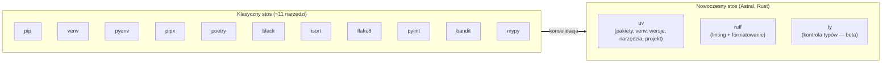

# 2. Środowiska i Narzędzia: Profesjonalne Zarządzanie Projektem

> [!NOTE]
> Opanowanie narzędzi do zarządzania środowiskiem i zależnościami jest tak samo ważne, jak znajomość składni języka. W Pythonie, gdzie ekosystem bibliotek jest ogromny, izolacja zależności projektowych jest absolutnie kluczowa dla utrzymania porządku i zapewnienia reprodukowalności.

---

## Podatek dziesięciu narzędzi

Deweloper przychodzący z C#/Java oczekuje jednego, spójnego toolingu: `dotnet` lub `cargo`/`mvn` robią praktycznie wszystko. W Pythonie przez lata było inaczej. Tradycyjny, „klasyczny" stos to **około jedenastu osobnych narzędzi**, które trzeba zainstalować, skonfigurować i utrzymać w spójności wersji w całym zespole — **zanim napiszesz pierwszą linijkę kodu produkcyjnego**:

| # | Narzędzie | Odpowiedzialność |
| :--- | :--- | :--- |
| 01 | `pip` | instalacja pakietów |
| 02 | `venv` | środowiska wirtualne |
| 03 | `pyenv` | zarządzanie wersjami Pythona |
| 04 | `pipx` | instalacja narzędzi globalnych |
| 05 | `poetry` | zarządzanie projektem i plik lock |
| 06 | `black` | formatowanie kodu |
| 07 | `isort` | sortowanie importów |
| 08 | `flake8` | podstawowy linting |
| 09 | `pylint` | głęboka analiza statyczna |
| 10 | `bandit` | analiza bezpieczeństwa |
| 11 | `mypy` | kontrola typów |

Każde z tych narzędzi ma własny plik konfiguracyjny i własny cykl wydawniczy. To jedenaście niezależnych miejsc, w których wersje mogą się rozjechać między laptopem juniora, laptopem seniora a CI — i jedenaście rzeczy, które nowa osoba w zespole musi poprawnie skonfigurować, zanim cokolwiek zadziała.

Współczesny ekosystem (stan na maj 2026) redukuje ten stos do **dwóch narzędzi** — `uv` + `ruff` — a wkrótce do **trzech** (po dodaniu `ty`). Wszystkie pochodzą od jednej firmy ([Astral](https://astral.sh/)), wszystkie napisano w Rust, wszystkie czytają jeden plik konfiguracyjny `pyproject.toml` i ze sobą współpracują.

> [!TIP]
> Trzy narzędzia, które ze sobą nie walczą, zastępują jedenaście, które walczyły.



---

## uv — kompleksowe zarządzanie projektem

> [!TIP]
> **`uv` to domyślna rekomendacja dla nowych projektów w Pythonie (stan na maj 2026).** Jedno binarium zastępuje cały dolny rząd klasycznego stosu: `pip`, `virtualenv`, `pyenv`, `pipx`, `poetry`, `pip-tools` oraz `twine`.

`uv` to pojedyncze, samodzielne binarium napisane w języku Rust. Jego cechy:

* **Wydajność** — operacje na zależnościach wykonuje **10–100x szybciej niż `pip`**.
* **Licencja MIT** — w pełni otwarte oprogramowanie.
* **Brak vendor lock-in** — `uv` trzyma się standardowego pliku `pyproject.toml` ([PEP 621](https://peps.python.org/pep-0621/)). Projekt zarządzany przez `uv` pozostaje w pełni kompatybilny z `pip` i innymi narzędziami zgodnymi ze standardami.

### Instalacja

`uv` instaluje się **samodzielnym instalatorem**, a nie przez `pip` — w ten sposób `uv` jest niezależne od jakiejkolwiek konkretnej instalacji Pythona (potrafi nawet sam pobierać interpretery):

```bash
# Linux / macOS
curl -LsSf https://astral.sh/uv/install.sh | sh

# Windows (PowerShell)
powershell -ExecutionPolicy ByPass -c "irm https://astral.sh/uv/install.ps1 | iex"
```

### Workflow projektowy

To **główny, zalecany sposób** pracy z `uv` — pełne zarządzanie projektem, a nie tylko instalacja pakietów:

```bash
uv init my-project           # nowy projekt: tworzy pyproject.toml i strukturę (venv + uv.lock powstają leniwie przy pierwszym `uv sync`/`uv run`)
uv add fastapi pydantic      # dodaj zależność: resolve + lock + install (~0,5 s)
uv add --dev pytest ruff     # zależności deweloperskie
uv remove fastapi            # usuń zależność
uv sync                      # zsynchronizuj venv z lockfile
uv sync --frozen             # CI: dokładnie wg lockfile, reprodukowalne buildy
uv run pytest                # uruchom w venv BEZ aktywacji (`source .venv/bin/activate` zbędne)
uv run hello.py              # uruchom skrypt
uv python install 3.14       # zainstaluj wersję Pythona (zastępuje pyenv)
uv tool install ruff         # globalne narzędzie (zastępuje pipx)
uv pip sync requirements.txt # tryb kompatybilny z pip (dla starszych projektów)
```

Zwróć uwagę na `uv run` — `uv` sam dba o to, by skrypt wykonał się w odpowiednim środowisku wirtualnym z aktualnymi zależnościami. Ręczna aktywacja venva (`source .venv/bin/activate`) staje się zbędna.

### Benchmark wydajności

Pomiar przy zimnym cache, dla projektu `fastapi` + `pydantic` + `pandas` wraz z ~30 zależnościami tranzytywnymi[^1]:

| Operacja | uv | Poetry | pip |
| :--- | :--- | :--- | :--- |
| Rozwiązanie zależności | ~0,5 s | ~30 s | zmienne |
| Instalacja pakietów | ~1,2 s | ~45 s | ~30 s |
| Utworzenie lockfile | natychmiast | minuty | brak lockfile |

### PEP 723 — skrypty z zależnościami inline

To jedna z najbardziej przełomowych funkcji `uv`. [PEP 723](https://peps.python.org/pep-0723/) pozwala zadeklarować zależności **wewnątrz samego pliku skryptu**, w specjalnym komentarzu. Polecenie `uv run hello.py` samo pobierze odpowiednią wersję Pythona, zbuduje tymczasowe środowisko wirtualne i zainstaluje zależności — bez tworzenia projektu i bez `requirements.txt`:

```python
# /// script
# requires-python = ">=3.12"
# dependencies = [
#     "requests>=2.31",
#     "rich>=13.0",
# ]
# ///
import requests
from rich import print

resp = requests.get("https://api.github.com/repos/astral-sh/ruff")
stars = resp.json()["stargazers_count"]
print(f"Ruff has {stars} stars!")
```

Pojedynczy plik `.py` staje się w pełni samowystarczalnym, reprodukowalnym narzędziem — idealnie nadaje się na skrypty pomocnicze, automatyzacje i przykłady do dokumentacji.

### uv w Dockerze i CI

W obrazie kontenera `uv` można skopiować bezpośrednio z oficjalnego obrazu, bez instalatora. Tryb `--frozen` gwarantuje, że build użyje dokładnie wersji z lockfile:

```dockerfile
FROM python:3.12-slim
COPY --from=ghcr.io/astral-sh/uv:latest /uv /bin/uv
WORKDIR /app
COPY pyproject.toml uv.lock ./
RUN uv sync --frozen --no-dev
COPY . .
CMD ["uv", "run", "python", "-m", "app"]
```

---

## venv i pip — podstawy oraz wiedza legacy

`venv` to moduł dostarczany ze standardową biblioteką Pythona, a `pip` to wbudowany instalator pakietów. Warto je znać — to fundament, na którym budują wszystkie nowsze narzędzia, i wciąż spotkasz je w niezliczonych istniejących projektach.

**Typowy, klasyczny cykl pracy:**

1.  **Tworzenie środowiska** (np. w folderze `.venv`):
    ```bash
    python -m venv .venv
    ```

2.  **Aktywacja środowiska:**
    ```bash
    # Windows (PowerShell/CMD)
    .venv\Scripts\activate

    # Linux / macOS
    source .venv/bin/activate
    ```

3.  **Instalacja pakietów** za pomocą `pip`:
    ```bash
    pip install pandas numpy
    ```

4.  **Zapisywanie zależności** do pliku `requirements.txt`:
    ```bash
    pip freeze > requirements.txt
    ```

> [!WARNING]
> Współczesnym standardem konfiguracji projektu jest **`pyproject.toml`** ([PEP 621](https://peps.python.org/pep-0621/)) wraz z plikiem lock (`uv.lock`), który zamraża dokładny, reprodukowalny zestaw wersji. Para `requirements.txt` + `pip freeze` to działające, ale minimalistyczne i z dzisiejszej perspektywy **legacy** podejście: `pip freeze` zrzuca jednym płaskim spisem zarówno zależności bezpośrednie, jak i tranzytywne — bez ich rozróżnienia — przez co trudno odczytać, czego projekt naprawdę wymaga.

**Migracja istniejącego projektu na `uv`** jest prosta:

```bash
uv init                              # utwórz pyproject.toml w istniejącym projekcie
uv add --requirements requirements.txt   # zaimportuj zależności z requirements.txt
```

---

## Poetry — starsza, wciąż popularna alternatywa

[Poetry](https://python-poetry.org/) to dojrzałe narzędzie, które przed nadejściem `uv` było najczęstszym wyborem do zarządzania projektem i budowania pakietów. Wprowadziło do ekosystemu plik `pyproject.toml` jako centrum konfiguracji oraz `poetry.lock` dla deterministycznych instalacji.

> [!NOTE]
> Poetry to dziś **starsza, ale wciąż popularna alternatywa**. Dla nowych projektów rekomendujemy `uv`; Poetry pozostaje rozsądnym wyborem przede wszystkim wtedy, gdy projekt **już go używa** i nie ma powodu do migracji.

**Typowy cykl pracy:**

1.  **Tworzenie nowego projektu:**
    ```bash
    poetry new my-project
    cd my-project
    ```

2.  **Dodawanie zależności** — Poetry automatycznie zapisze je w `pyproject.toml`:
    ```bash
    # Zależności produkcyjne
    poetry add pandas numpy

    # Zależności deweloperskie (np. testy i lintery)
    poetry add --group dev pytest ruff
    ```

3.  **Instalacja zależności** z `poetry.lock` (jeśli istnieje) lub `pyproject.toml`:
    ```bash
    poetry install
    ```

4.  **Uruchamianie skryptów** w środowisku zarządzanym przez Poetry:
    ```bash
    poetry run python your_script.py
    ```

> [!WARNING]
> Od wersji **Poetry 2.0** (styczeń 2025) komenda `poetry shell` została **wydzielona do osobnego pluginu** i nie jest już dostępna domyślnie. Zamiast niej używaj `poetry run <komenda>` albo aktywuj środowisko przez `poetry env activate`.

---

## Linting, formatowanie i kontrola typów

Trzy różne kategorie narzędzi pilnują jakości kodu Pythona. Łatwo je pomylić, więc warto jasno rozdzielić ich role:

* **Linter** (`flake8`, `pylint`, `ruff`) — **czyta kod, ale go nie uruchamia**. Flaguje potencjalne bugi, martwy (nieosiągalny) kod, nieużywane importy i zmienne oraz niebezpieczne wzorce.
* **Formatter** (`black`, `ruff format`) — **przepisuje kod do jednego, kanonicznego stylu**. Eliminuje dyskusje o stylu na code review: nie ma już „twojego" i „mojego" formatowania, jest jedno.
* **Type checker** (`mypy`, `pyright`, `ty`) — **łapie błędy typów przed wdrożeniem**. Działa jak kompilator znany z C++/C#, tyle że opcjonalny — analizuje wskazówki typów (`type hints`) i zgłasza niezgodności.

### Ruff — jedno narzędzie zamiast pięciu

[Ruff](https://docs.astral.sh/ruff/) (Astral, Rust) łączy w jednym narzędziu funkcje lintera i formattera. Jest **pełnoprawnym zamiennikiem `black`** (formatter) oraz **`isort`** (sortowanie importów), pokrywa też **większość reguł `flake8`** i znaczną część reguł `pylint` oraz `bandit`. Warto jednak wiedzieć, że Ruff **nie jest jeszcze w 100% kompletnym zamiennikiem całego `pylint` ani `bandit`** — część ich reguł i wtyczek wciąż nie ma odpowiednika. Mimo to dla zdecydowanej większości projektów sam Ruff w zupełności wystarcza:

* implementuje **ponad 800 reguł** odtworzonych z **50+ wtyczek** klasycznego ekosystemu `flake8`;
* jest **10–100x szybszy niż `pylint`** — przelicenie ~50 000 linii kodu zajmuje mu około **1 sekundy**;
* całe codzienne API to **dwie komendy**:

```bash
ruff check . --fix    # lint + automatyczna naprawa wykrytych problemów
ruff format .         # formatowanie kodu
```

### Dwie szkoły konfiguracji w `pyproject.toml`

**Szkoła 1 — inkrementalna**: jawnie wybierasz konkretne rodziny reguł. Bezpieczne podejście do wdrażania `ruff` w istniejącym projekcie:

```toml
# Szkoła 1 — inkrementalna, jawna lista reguł
[tool.ruff]
line-length = 88
target-version = "py312"

[tool.ruff.lint]
select = ["E", "F", "I", "N", "UP", "B", "C4", "SIM"]
ignore = ["E501"]

[tool.ruff.format]
quote-style = "double"
```

**Szkoła 2 — „włącz wszystko"**: aktywujesz wszystkie reguły i wyłączasz tylko te, które ci przeszkadzają. Świetne dla nowych projektów i wymagających zespołów:

```toml
# Szkoła 2 — "włącz wszystko"
[tool.ruff]
line-length = 88
preview = true

[tool.ruff.lint]
select = ["ALL"]
ignore = ["D203", "D213", "COM812"]
```

### Integracja z VS Code

Po zainstalowaniu rozszerzenia `charliermarsh.ruff` dodaj do `.vscode/settings.json`, aby kod był lintowany, naprawiany i formatowany przy każdym zapisie:

```json
{
  "editor.formatOnSave": true,
  "editor.defaultFormatter": "charliermarsh.ruff",
  "editor.codeActionsOnSave": {
    "source.fixAll.ruff": "explicit",
    "source.organizeImports.ruff": "explicit"
  }
}
```

### Integracja z pre-commit

Hook `pre-commit` uruchamia `ruff` automatycznie przy każdym commicie, zanim kod trafi do repozytorium. Plik `.pre-commit-config.yaml`:

```yaml
repos:
  - repo: https://github.com/astral-sh/ruff-pre-commit
    rev: v0.8.6   # użyj najnowszego tagu — `pre-commit autoupdate` zaktualizuje automatycznie
    hooks:
      - id: ruff
        args: [--fix]
      - id: ruff-format
  - repo: https://github.com/pre-commit/pre-commit-hooks
    rev: v5.0.0
    hooks:
      - id: trailing-whitespace
      - id: end-of-file-fixer
```

> [!NOTE]
> Konkretne wersje hooków (`rev:`) szybko się starzeją — podane numery to tylko przykład z momentu pisania. Po utworzeniu pliku uruchom `pre-commit autoupdate`, aby podciągnąć wszystkie hooki do najnowszych tagów, i powtarzaj to okresowo.

### Type checkery

Wskazówki typów same z siebie niczego nie sprawdzają — potrzebny jest type checker:

* **`mypy`** — dojrzały, de facto standard, najszerzej wspierany przez ekosystem.
* **`pyright`** — type checker Microsoftu, osiąga najwyższą zgodność z oficjalną specyfikacją systemu typów; napędza wsparcie Pythona w VS Code.
* **`ty`** — type checker od Astral, w Rust, **10–60x szybszy od `mypy`**. Status: **beta** (od grudnia 2025), stabilne 1.0 celowane na 2026. Domyka toolchain `uv` + `ruff` + `ty`.

> [!NOTE]
> Narzędzia `black`, `flake8` oraz `isort` traktuj dziś jako **legacy** — wciąż działają i są obecne w wielu projektach, ale w nowych projektach ich rolę w całości przejmuje `ruff`.

> [!NOTE]
> W marcu 2026 **OpenAI przejęło firmę Astral** — twórcę `uv`, `ruff` i `ty`. Narzędzia pozostają otwartoźródłowe (licencja MIT) i oparte na standardach PEP, więc dla użytkownika nic się nie zmienia.
>
> Drugorzędnym, ale istotnym powodem, dla którego szybkość toolingu ma dziś znaczenie, jest **era asystentów kodu**. Modele takie jak Claude, Codex czy Copilot potrafią same wywołać linter lub type checker, sparsować jego wynik i na tej podstawie skorygować kod. Przy linterze działającym 30 sekund taka pętla samokorekty jest niepraktyczna; przy `ruff` zwracającym wynik w ~100 ms — staje się naturalna. Więcej o agentowych pętlach pracy z kodem znajdziesz w rozdziale [`06-generative-ai-and-rag.md`](./06-generative-ai-and-rag.md).

---

## Wersje Pythona, conda i pixi

### Zarządzanie wersjami Pythona

* **`pyenv`** — klasyczne narzędzie do instalowania i przełączania wielu wersji interpretera Pythona obok siebie. Wciąż działa, ale w nowoczesnym workflow jest w dużej mierze **zastępowane przez `uv python install`**, które robi to samo bez dodatkowej zależności.

### conda i Anaconda

[conda](https://docs.conda.io/) to menedżer pakietów i środowisk, który wciąż pozostaje istotny w **data science i ML**. Jego przewaga nad `pip` polega na tym, że potrafi instalować nie tylko pakiety Pythona, lecz także zależności spoza ekosystemu Pythona: biblioteki C, kompilatory czy sterowniki **CUDA** — co bywa kluczowe przy konfiguracji środowisk GPU.

> [!TIP]
> Jeśli używasz condy, instaluj pakiety z darmowego, społecznościowego kanału **`conda-forge`** zamiast z domyślnego kanału `defaults` — ten ostatni objęty jest komercyjnymi warunkami licencyjnymi Anacondy, które mogą obowiązywać większe organizacje.

### pixi

[pixi](https://prefix.dev/) (firmy prefix.dev) to nowoczesna alternatywa, która łączy najlepsze z obu światów: korzysta z pakietów `conda-forge` **oraz** z PyPI, oferuje szybkie rozwiązywanie zależności i plik lock. Dobry wybór dla projektów ML wymagających zarówno bibliotek systemowych, jak i czystych pakietów Pythona.

---

## Jupyter Notebooks — interaktywne programowanie

> [!NOTE]
> Jupyter Notebook to jedna z najpopularniejszych form pracy z Pythonem, szczególnie w data science, badaniach i nauczaniu. To interaktywne środowisko, gdzie kod, jego wyniki, wizualizacje i tekst (w formacie Markdown) współistnieją w jednym dokumencie (`.ipynb`).

Notebooki pozwalają na wykonywanie kodu w małych, niezależnych fragmentach (komórkach), co jest idealne do eksploracji danych i prototypowania algorytmów.

```python
# W notebooku każda komórka wykonuje się osobno

# Komórka 1: Import bibliotek
import pandas as pd
import matplotlib.pyplot as plt

# Komórka 2: Wczytanie i wyświetlenie danych
# Wynik (tabela) wyświetli się bezpośrednio pod komórką
data = pd.read_csv('sales.csv')
data.head()

# Komórka 3: Wygenerowanie i wyświetlenie wykresu
# Wykres pojawi się bezpośrednio pod komórką
plt.figure(figsize=(10, 6))
plt.plot(data['date'], data['revenue'])
plt.title('Przychody w czasie')
plt.show()
```

> [!TIP]
> Dzięki `uv` możesz uruchomić JupyterLab **bez globalnej instalacji** czegokolwiek — `uv` zbuduje na żądanie tymczasowe środowisko z Jupyterem:
> ```bash
> uv run --with jupyter jupyter lab
> ```

### Główne środowiska notebookowe

  * **Jupyter Notebook / JupyterLab**: Klasyczne, uruchamiane lokalnie w przeglądarce.
  * **Google Colab**: Darmowe notebooki w chmurze z dostępem do GPU i TPU od Google.
  * **VS Code**: Doskonałe, wbudowane wsparcie dla plików `.ipynb`, łączące zalety IDE i notebooka.
  * **Platformy chmurowe**: Databricks, Kaggle, Deepnote oferują zaawansowane, zespołowe środowiska notebookowe.

> [!WARNING]
> Notebooki mogą prowadzić do problemów z reprodukowalnością kodu, ponieważ kolejność wykonywania komórek ma znaczenie. Dla kodu produkcyjnego, który ma być uruchamiany automatycznie, preferowaną formą są standardowe pliki `.py`.

### Wersjonowanie notebooków w git

Pliki `.ipynb` to w istocie dokumenty JSON zawierające również wyniki wykonania (w tym binarne obrazy wykresów). To sprawia, że `git diff` na notebooku bywa nieczytelny, a repozytorium puchnie. Dwa narzędzia rozwiązują ten problem:

  * **`jupytext`** — synchronizuje notebook z czytelnym dla człowieka plikiem `.py` (lub Markdown), który dobrze nadaje się do code review i wersjonowania.
  * **`nbstripout`** — hook czyszczący wyniki komórek przed commitem, dzięki czemu do repozytorium trafia wyłącznie kod.

---

## Źródła i przypisy

[^1]: Benchmarki wydajności mają charakter orientacyjny — rzędy wielkości odpowiadają publikowanym pomiarom Astral; konkretne czasy zależą od projektu, sieci i sprzętu.
