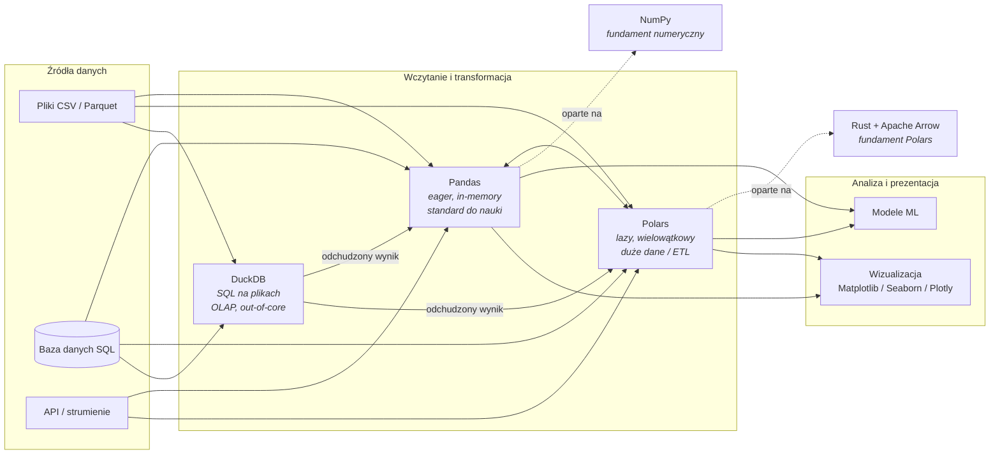
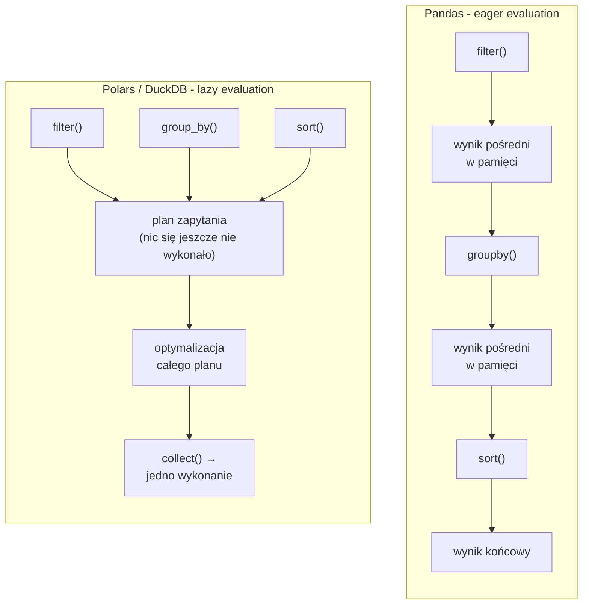

# 3. Stos Technologiczny Data Science: Praca z Danymi w Praktyce

> [!NOTE]
> Python jest de facto standardem w świecie Data Science. Jego siła tkwi w dojrzałym ekosystemie bibliotek, które sprawiają, że złożone operacje na danych, analiza statystyczna i wizualizacja stają się intuicyjne i wydajne. Twoje dotychczasowe doświadczenie, szczególnie w SQL, da Ci ogromną przewagę w opanowaniu tych narzędzi.

---

## 🐼 [Pandas](https://pandas.pydata.org/): "SQL na sterydach w Pythonie"

[**Pandas**](https://pandas.pydata.org/) to absolutnie fundamentalna biblioteka do analizy i manipulacji danymi w Pythonie. Jeżeli Twoim głównym narzędziem do pracy z danymi był do tej pory SQL, poczujesz się tu jak w domu, ale z dodatkowymi "supermocami". Główną strukturą danych w Pandas jest **`DataFrame`**, który można traktować jak programowalną, trzymaną w pamięci tabelę SQL.

Operacje, które znasz z codziennej pracy z bazami danych – `SELECT`, `WHERE`, `GROUP BY`, `JOIN` – mają swoje bezpośrednie, ekspresyjne odpowiedniki w metodach Pandas.

### Podstawowe Operacje na DataFrame

Oto jak typowe zadania analityczne przekładają się na kod Pandas:

* **Wczytywanie danych (`SELECT * FROM ...`)**: Pandas potrafi wczytywać dane z wielu formatów, najczęściej z plików CSV, Excel, czy bezpośrednio z bazy danych SQL.
    ```python
    import pandas as pd

    # Wczytanie danych z pliku CSV do obiektu DataFrame
    # Jest to odpowiednik załadowania tabeli do pamięci
    df = pd.read_csv('data.csv')
    ```

* **Filtrowanie (`WHERE`)**: Możesz filtrować wiersze w DataFrame używając intuicyjnej składni, która przypomina operacje wektorowe.
    ```python
    # Wybierz wiersze, gdzie wiek (age) jest większy niż 25
    filtered_df = df[df['age'] > 25]
    ```

* **Grupowanie (`GROUP BY`)**: Agregacja danych to jedna z najmocniejszych stron Pandas. Metoda `.groupby()` jest niezwykle elastyczna.
    ```python
    # Oblicz średnią pensję (salary) dla każdego działu (department)
    avg_salary_by_dept = df.groupby('department')['salary'].mean()
    ```

* **Łączenie danych (`JOIN`)**: Pandas oferuje funkcję `pd.merge()`, która pozwala na wykonywanie wszystkich typów złączeń znanych z SQL (`LEFT`, `RIGHT`, `INNER`, `OUTER`).
    ```python
    # Wykonaj lewe złączenie (left join) na podstawie kolumny 'id'
    merged_df = pd.merge(df1, df2, on='id', how='left')
    ```

### Przykład Porównawczy: SQL vs Pandas

Wyobraź sobie, że chcesz wykonać następujące zapytanie analityczne w SQL.

**Zapytanie SQL:**
```sql
SELECT
    region,
    SUM(revenue) as total_revenue
FROM
    sales
WHERE
    revenue > 1000
GROUP BY
    region
ORDER BY
    total_revenue DESC;
```

**Odpowiednik w Pandas:**
Ten sam rezultat można osiągnąć w Pandas za pomocą czytelnego łańcucha operacji, który jest nie tylko wydajny, ale i łatwy do debugowania.

```python
import pandas as pd

# Wczytanie danych (analogiczne do FROM sales)
df = pd.read_csv('sales.csv')

# Łańcuch operacji, który krok po kroku transformuje dane
result = (
    df[df['revenue'] > 1000]  # Krok 1: Analogia do klauzuli WHERE
    .groupby('region')        # Krok 2: Analogia do GROUP BY
    .agg(total_revenue=('revenue', 'sum')) # Krok 3: Analogia do SUM(...) z aliasem
    .sort_values(by='total_revenue', ascending=False) # Krok 4: Analogia do ORDER BY
)

print(result)
```

Pandas doskonale integruje się z całym ekosystemem Pythona, pozwalając płynnie przechodzić od analizy danych do ich wizualizacji czy wykorzystania w modelach machine learning.

### Pandas 3.0 - co się zmieniło

Wydanie **Pandas 3.0.0** (21 stycznia 2026) wprowadza dwie zmiany, które warto rozumieć od samego początku:

* **Copy-on-Write (CoW) domyślnie włączony.** Do tej pory Pandas bywał nieprzewidywalny: nie zawsze było wiadomo, czy operacja indeksowania zwraca *kopię* danych, czy *widok* na te same dane w pamięci. Skutkiem był słynny `SettingWithCopyWarning` i trudne do wykrycia błędy, gdzie modyfikacja DataFrame uzyskanego z wycinka po cichu zmieniała oryginał. Od wersji 3.0 obowiązuje spójna semantyka: **zapis do obiektu uzyskanego z indeksowania, wycinka lub metody innego DataFrame nigdy nie zmienia oryginału po cichu** - a kopia danych jest tworzona zawsze i dokładnie w momencie zapisu (stąd nazwa *copy-on-write*), więc jest to bezpieczne **i** wydajne. Eliminuje to `SettingWithCopyWarning`.
    ```python
    subset = df[df["a"] > 0]   # obiekt pochodny z indeksowania
    subset.loc[:, "b"] = 0     # CoW: zapis dotyczy WYŁĄCZNIE subset, df pozostaje nietknięty
    ```
    > [!WARNING]
    > CoW **nie dotyczy** zwykłego przypisania nazwy zmiennej. `df2 = df` nadal tworzy *alias* - `df2` i `df` to ten sam obiekt, więc `df2.loc[...] = ...` zmieni również `df`. Jeśli potrzebujesz niezależnej kopii, użyj jawnie `df.copy()`.

* **Dedykowany typ `str` zamiast `object`.** Kolumny tekstowe nie są już domyślnie przechowywane jako ogólny `object` (czyli tablica wskaźników na obiekty Pythona), lecz jako dedykowany typ string. Konkretny backend zależy od środowiska: jeśli zainstalowano **PyArrow**, Pandas użyje wydajnego, kolumnowego formatu PyArrow; w przeciwnym razie zadziała wbudowany fallback (typ string oparty o NumPy). Tak czy inaczej daje to mniejsze zużycie pamięci i szybsze operacje na tekstach niż dawne `object` - a zainstalowanie PyArrow dodatkowo te zyski powiększa.

Możesz też świadomie zażądać, by **wszystkie** kolumny korzystały z typów PyArrow zamiast NumPy - np. dla wsparcia natywnego `NULL` we wszystkich typach czy lepszej interoperacyjności:

```python
import pandas as pd

# Backend PyArrow dla całego DataFrame:
# spójna obsługa wartości brakujących i wydajne typy kolumnowe
df = pd.read_csv('sales.csv', dtype_backend="pyarrow")
```

> [!WARNING]
> Pandas - niezależnie od wersji - działa w modelu **in-memory**: cały zbiór danych musi zmieścić się w pamięci RAM. Dla zbiorów rzędu kilkuset MB to żaden problem, ale przy danych liczonych w gigabajtach lub przy produkcyjnych pipeline'ach ETL napotkasz ścianę. To naturalny moment, by sięgnąć po narzędzia zaprojektowane z myślą o większej skali - **Polars** (przetwarzanie strumieniowe i wielowątkowe) oraz **DuckDB** (zapytania SQL bezpośrednio na plikach na dysku). Oba opisujemy w dalszej części rozdziału.

-----

## 🔢 [NumPy](https://numpy.org/): Fundament Obliczeń Naukowych

[**NumPy (Numerical Python)**](https://numpy.org/) to biblioteka, na której zbudowana jest praktycznie cała naukowa część ekosystemu Pythona, włączając w to Pandas. Jej rdzeń napisany jest w skompilowanych językach **C i C++** (kod w Fortranie ma dziś znaczenie marginalne - odpowiada za niewielkie fragmenty, a wywołania algebry liniowej i tak delegowane są do zewnętrznych bibliotek). Zapewnia to ogromną wydajność operacji numerycznych, porównywalną z wyspecjalizowanymi bibliotekami do algebry liniowej jak [BLAS](https://en.wikipedia.org/wiki/Basic_Linear_Algebra_Subprograms) czy [LAPACK](https://en.wikipedia.org/wiki/LAPACK).

  * Głównym obiektem w NumPy jest `ndarray` – potężna, wielowymiarowa tablica przechowująca dane **jednego typu**.
  * Kluczową ideą pracy z NumPy jest **wektoryzacja** – wykonywanie operacji na całych tablicach zamiast na pojedynczych elementach w pętlach, co jest znacznie szybsze.

> [!NOTE]
> Współczesny ekosystem bazuje już na linii **NumPy 2.x** (aktualnie 2.4.x). W stosunku do serii 1.x wprowadziła ona m.in. nowe, spójniejsze reguły **promocji typów** (NEP 50 - wynikowy typ operacji zależy teraz od typów, a nie od wartości operandów) oraz uporządkowanie i odchudzenie publicznego API. Dla uczącego się oznacza to przede wszystkim jedno: pisząc nowy kod od podstaw, domyślnie pracujesz już na NumPy 2.x i nie musisz uczyć się historycznych zachowań z serii 1.x.

-----

## ⚡ [Polars](https://pola.rs/): Szybsza Alternatywa dla Pandas

[**Polars**](https://pola.rs/) to nowoczesna biblioteka do pracy z DataFrame'ami, zaprojektowana z myślą o **wydajności i dużej skali**. W przeciwieństwie do Pandas (rdzeń w C/Cython, koordynacja w Pythonie) Polars jest w całości napisany w **Rust**, co daje mu kilka strukturalnych przewag:

* **Wielowątkowość domyślnie.** Polars wykorzystuje wszystkie rdzenie procesora bez dodatkowej konfiguracji - Pandas operuje zasadniczo jednowątkowo.
* **Storage kolumnowy** (oparty o Apache Arrow) - efektywny pamięciowo i przyjazny pamięci podręcznej procesora.
* **Lazy evaluation (leniwa ewaluacja).** Zamiast wykonywać każdą operację natychmiast, Polars może zbudować *plan zapytania* (LazyFrame), zoptymalizować go jako całość (np. przesunąć filtry jak najwcześniej, pominąć nieużywane kolumny) i uruchomić dopiero na `.collect()`. To dokładnie ta sama idea, którą znasz z optymalizatora zapytań SQL czy z odroczonego wykonania `IQueryable` w LINQ.

W praktyce przy dużych zbiorach i produkcyjnym ETL Polars bywa wielokrotnie szybszy od Pandas, a często też oszczędniejszy pamięciowo.

### Filozofia: wyrażenia zamiast indeksowania

Składnia Polars opiera się na **API wyrażeń** (`expressions`) - buduje się czytelny łańcuch metod `.filter()`, `.group_by()`, `.with_columns()`, `.select()`. Dla kogoś znającego SQL lub LINQ jest to bardziej naturalne niż charakterystyczne dla Pandas indeksowanie nawiasami kwadratowymi i maskami logicznymi.

```python
import polars as pl

# Tryb lazy: budujemy plan zapytania, wykonanie następuje na .collect()
result = (
    pl.scan_csv("sales.csv")                       # leniwe źródło danych
    .filter(pl.col("revenue") > 1000)              # WHERE
    .group_by("region")                            # GROUP BY
    .agg(pl.col("revenue").sum().alias("total_revenue"))  # SUM(...) AS ...
    .sort("total_revenue", descending=True)        # ORDER BY ... DESC
    .collect()                                     # uruchom zoptymalizowany plan
)

print(result)
```

Porównaj to z analogicznym łańcuchem w Pandas z początku rozdziału - logika jest niemal identyczna, różni się głównie zapis (`pl.col("...")` zamiast `df["..."]`) oraz to, że Pandas wykonuje każdy krok od razu (**eager**), a Polars może odroczyć całość (**lazy**).

> [!TIP]
> Polars pozycjonujemy jako **szybszą alternatywę dla Pandas przy dużych danych i produkcyjnym ETL**, a nie jako narzędzie pierwszego wyboru do nauki. Pandas pozostaje *lingua franca* Data Science: większość tutoriali, kursów i przykładów integracji z bibliotekami ML zakłada Pandas. Naucz się najpierw Pandas, a po Polars sięgnij, gdy wydajność stanie się realnym ograniczeniem. Konwersja między nimi jest tania (`df.to_pandas()` / `pl.from_pandas(df)`), bo oba opierają się na formacie Arrow.

-----

## 🦆 [DuckDB](https://duckdb.org/): SQL Bezpośrednio na Plikach

[**DuckDB**](https://duckdb.org/) to **in-process analityczna baza danych SQL** (OLAP). "In-process" oznacza, że - podobnie jak SQLite - działa wewnątrz Twojego procesu Pythona: nie ma osobnego serwera, nie ma konfiguracji, instalacja to jeden `pip install duckdb`. Różnica względem SQLite leży w przeznaczeniu: SQLite jest zoptymalizowany pod transakcje (OLTP), DuckDB pod **zapytania analityczne** na dużych zbiorach (OLAP - agregacje, skany, joiny po milionach wierszy).

Dla kogoś, kto biegle zna SQL, DuckDB to najbardziej naturalny pomost do Pythona: pozwala pisać **czysty SQL** bezpośrednio na plikach `CSV` i `Parquet` oraz na DataFrame'ach Pandas i Polars - bez ręcznego ładowania całości do pamięci. DuckDB czyta tylko te kolumny i wiersze, które są faktycznie potrzebne do zapytania.

```python
import duckdb

# SQL bezpośrednio na pliku Parquet - bez wcześniejszego wczytywania
result = duckdb.sql("""
    SELECT region, SUM(revenue) AS total_revenue
    FROM 'data.parquet'
    WHERE revenue > 1000
    GROUP BY region
    ORDER BY total_revenue DESC
""").df()   # wynik jako DataFrame Pandas

# DuckDB widzi też DataFrame'y z pamięci jak zwykłe tabele
import pandas as pd
sales = pd.read_csv("sales.csv")
duckdb.sql("SELECT region, COUNT(*) FROM sales GROUP BY region").show()
```

> [!NOTE]
> DuckDB, Polars i Pandas nie wykluczają się - często współpracują w jednym pipeline. Typowy wzorzec: DuckDB wykonuje ciężkie filtrowanie i agregację po stronie plików na dysku, zwraca już *odchudzony* wynik, a dalszą analizę i wizualizację prowadzisz w Pandas lub Polars w pamięci.

-----

## 📓 Notebooki - Środowisko Pracy

Eksploracyjna analiza danych rzadko jest liniowa - to cykl "uruchom fragment, obejrzij wynik, popraw, powtórz". Domyślnym środowiskiem do takiej pracy są **notebooki**.

* [**Jupyter Notebook / JupyterLab**](https://jupyter.org/): de facto standard interaktywnej analizy danych. Kod dzieli się na **komórki** uruchamiane niezależnie, a wyniki - tabele, wykresy, tekst - wyświetlają się od razu pod nimi. Notebook świetnie sprawdza się w eksploracji i prezentacji wyników, ale ma znaną wadę: kolejność *uruchamiania* komórek może różnić się od ich kolejności w pliku, co prowadzi do **ukrytego stanu** i wyników trudnych do odtworzenia. Dodatkowo format `.ipynb` to JSON z wynikami w środku - mało przyjazny dla `git diff`.

* [**marimo**](https://marimo.io/): nowoczesna, **reaktywna** alternatywa, która adresuje te bolączki:
  * **Notebooki to czyste pliki `.py`** - w pełni przyjazne dla gita i code review, importowalne jak zwykłe moduły.
  * **Reaktywne wykonywanie** - gdy zmienisz komórkę, marimo automatycznie przelicza wszystkie komórki, które od niej zależą (model zbliżony do arkusza kalkulacyjnego). Eliminuje to problem ukrytego stanu - środowisko zawsze jest spójne.
  * **Deploy jako aplikacja webowa** - ten sam notebook można uruchomić jako interaktywną aplikację, bez przepisywania kodu.

> [!TIP]
> Jupyter poznasz tak czy inaczej - to wspólny język całej branży i większości materiałów edukacyjnych. marimo warto mieć na uwadze, gdy notebook ma trafić do repozytorium, code review lub na produkcję jako aplikacja.

-----

## 🔄 Miejsce Narzędzi w Pipeline Data Science

Poniższy diagram porządkuje, gdzie w typowym przepływie pracy z danymi sytuuje się każde z opisanych narzędzi:



Różnicę między modelem **eager** (Pandas - każdy krok wykonywany natychmiast) a **lazy** (Polars/DuckDB - najpierw plan zapytania, optymalizacja, potem wykonanie) ilustruje poniższy schemat:



-----

## ✅ [Pydantic](https://docs.pydantic.dev/): Gwarancja Jakości Danych w Runtime

Dla dewelopera przyzwyczajonego do statycznego typowania, [**Pydantic**](https://docs.pydantic.dev/) jest jak powiew świeżego powietrza. Wprowadza porządek i bezpieczeństwo typów do dynamicznego świata Pythona. Jest to nowoczesna biblioteka służąca do **walidacji danych i zarządzania ustawieniami** przy użyciu standardowych wskazówek typów (`type hints`).

> [!NOTE]
> Standardem jest dziś **Pydantic v2** (aktualnie linia 2.12.x). W przeciwieństwie do v1 jego rdzeń walidacji (`pydantic-core`) napisany jest w **Rust**, co przekłada się na walidację rzędu kilku razy szybszą niż w v1. Pisząc nowy kod, używasz v2 - i to jego API (m.in. metoda `model_validate` w przykładzie poniżej) pokazujemy w tym przewodniku.

Definiujesz schemat danych jako klasę dziedziczącą po `BaseModel`, a Pydantic automatycznie:

1.  Sparsuje dane wejściowe (np. z JSON).
2.  Zwaliduje je pod kątem zdefiniowanych typów i ograniczeń.
3.  Przekonwertuje na poprawnie otypowany obiekt Pythona.
4.  W razie niezgodności rzuci czytelne, szczegółowe błędy.

```python
from pydantic import BaseModel, EmailStr

class User(BaseModel):
    name: str
    age: int
    email: EmailStr # Pydantic ma wbudowane typy specjalne, np. do walidacji e-maili

# Pydantic automatycznie skonwertuje string "30" na int
# i zweryfikuje poprawność adresu email.
user_data = {"name": "John Doe", "age": "30", "email": "john.doe@example.com"}
user = User.model_validate(user_data)

print(user.age) # -> 30 (już jako int)
```

> [!NOTE]
> Typ `EmailStr` wymaga dodatkowej zależności `email-validator` - sama instalacja `pydantic` jej nie zawiera, a użycie `EmailStr` bez niej rzuci błąd importu. Zainstaluj ją razem z Pydantic za pomocą tzw. *extra*: `uv add "pydantic[email]"` (lub `pip install "pydantic[email]"`).

Pydantic jest absolutnie kluczowym narzędziem przy budowie solidnych API (jest sercem **FastAPI**) oraz niezawodnych pipeline'ów przetwarzania danych.

-----

## 📈 [Wizualizacja Danych](https://matplotlib.org/): Opowiadanie Historii

Surowe liczby rzadko kiedy opowiadają całą historię. Ekosystem Pythona oferuje bogaty zestaw narzędzi do wizualizacji, które pomogą Ci zrozumieć dane i zaprezentować wyniki.

  * [**Matplotlib**](https://matplotlib.org/): To podstawowa, niskopoziomowa biblioteka do tworzenia wykresów, stanowiąca fundament dla wielu innych narzędzi. Daje Ci pełną, granularną kontrolę nad każdym aspektem wykresu, ale przez to bywa "gadatliwa" (wymaga więcej kodu do osiągnięcia prostego efektu). Można ją traktować jak "C++ świata wizualizacji" lub odpowiednik `pyplot` z MATLABa.

  * [**Seaborn**](https://seaborn.pydata.org/): To wysokopoziomowe API zbudowane na bazie Matplotlib. Jego celem jest tworzenie estetycznych i informatywnych **wykresów statystycznych** przy użyciu znacznie mniejszej ilości kodu. Jest idealny do szybkiej eksploracji danych.

  * [**Plotly**](https://plotly.com/python/): Jeśli potrzebujesz **interaktywnych wizualizacji**, Plotly jest najlepszym wyborem. Pozwala tworzyć wykresy, na których użytkownik może przesuwać widok, powiększać, czy wyświetlać dodatkowe informacje po najechaniu myszką, przez wykorzystanie interfejsu webowego. To czyni go idealnym narzędziem do budowy dashboardów i aplikacji webowych.
