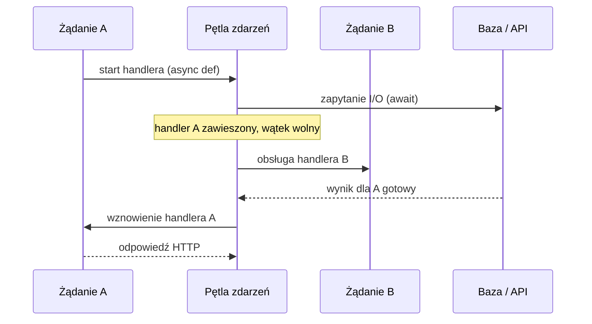
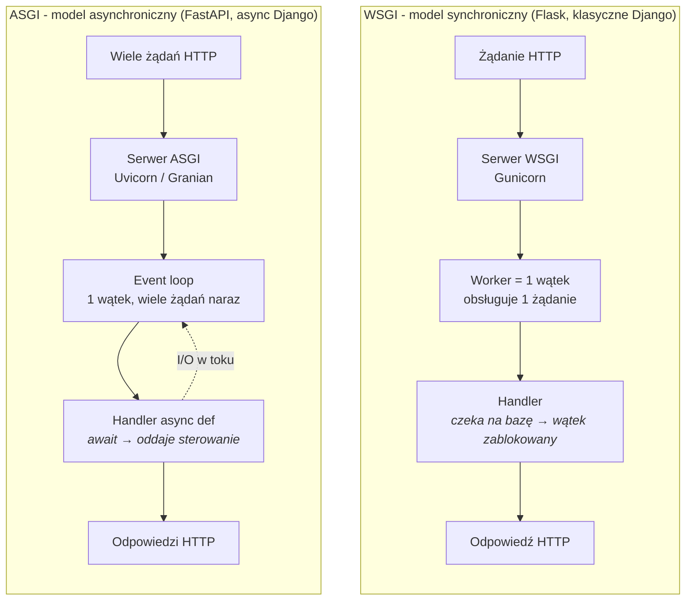

# 4. Web Development i API: Tworzenie Usług w Pythonie

> [!NOTE]
> Twoje doświadczenie w tworzeniu aplikacji webowych jest bezcenne w świecie Pythona. Koncepcje takie jak cykl życia żądania i odpowiedzi (`request`/`response`), routing, middleware czy komunikacja z bazą danych są uniwersalne. Python oferuje dojrzały i zróżnicowany ekosystem frameworków, które pozwalają te koncepcje efektywnie implementować.

## Wybór Frameworka: Znajdź Narzędzie Odpowiednie do Zadania

Python posiada trzy główne frameworki webowe, które różnią się filozofią, zakresem i najlepszymi przypadkami użycia. Wybór zależy od skali projektu, wymagań dotyczących wydajności i preferowanego stylu pracy.

---

### [Flask](https://flask.palletsprojects.com/en/stable/): Minimalistyczny i Elastyczny Mikro-framework 🧱

[Flask](https://flask.palletsprojects.com/en/stable/) kieruje się filozofią "zrób to sam". Dostarcza solidny, ale minimalistyczny rdzeń, który zajmuje się routingiem i obsługą żądań, a wszystkie dodatkowe funkcjonalności, takie jak obsługa bazy danych czy walidacja formularzy, pozostawia deweloperowi do wyboru i integracji za pomocą zewnętrznych bibliotek.

* **Filozofia**: Minimalizm i elastyczność. Dostajesz podstawowe narzędzia, a resztę budujesz sam.
* **Wydajność**: Działa w oparciu o synchroniczny standard **WSGI**[^wsgi-spec], co czyni go wolniejszym od FastAPI w zadaniach wymagających dużej liczby operacji I/O.
* **ORM**: Brak wbudowanego. Najczęściej używany z [**SQLAlchemy**](https://www.sqlalchemy.org/), potężną, niezależną biblioteką ORM.
* **Najlepszy do...**: Małych i średnich projektów, prototypów oraz aplikacji, gdzie kluczowa jest pełna kontrola nad doborem komponentów i elastyczność architektury.

```python
from flask import Flask, jsonify

# Inicjalizacja aplikacji Flask
app = Flask(__name__)

# Definicja endpointu (trasy)
@app.route('/hello')
def hello():
    return jsonify({"message": "Hello, World!"})
```

> [!NOTE]
> **Flask czy FastAPI?** Wybierz Flaska, gdy zależy Ci na maksymalnej elastyczności i pełnej kontroli nad każdym komponentem (ORM, autentykacja, walidacja — sam dobierasz). Wybierz FastAPI, gdy priorytetem jest wydajność, bezpieczeństwo typów i gotowa dokumentacja API — FastAPI daje to „z pudełka". Flask pozostaje doskonałym wyborem do mikrousług i małych API.

-----

### [FastAPI](https://fastapi.tiangolo.com/): Nowoczesne, Wysokowydajne API 🚀

[FastAPI](https://fastapi.tiangolo.com/) to dziś **ugruntowany standard tworzenia API w Pythonie**. Zbudowany od podstaw z myślą o tworzeniu API, łączy wysoką wydajność z bardzo dobrym doświadczeniem deweloperskim i przez ostatnie lata stał się domyślnym wyborem dla nowych usług.

  * **Filozofia**: "API first", wydajność i łatwość tworzenia.
  * **Wydajność**: Jedna z najwyższych w całym ekosystemie Pythona - zasługa działania w oparciu o nowoczesny, **asynchroniczny standard ASGI[^asgi-spec]**.
  * **Kluczowe Funkcje**:
      * **Wbudowana walidacja danych**: Wykorzystuje [**Pydantic v2**](https://docs.pydantic.dev/) (zob. rozdział o stosie Data Science) i wskazówki typów (`type hints`) do automatycznej walidacji przychodzących żądań i serializacji odpowiedzi.
      * **Automatyczna dokumentacja**: Na podstawie kodu i typów automatycznie generuje interaktywną dokumentację API (w standardach OpenAPI i JSON Schema), dostępną pod adresami `/docs` ([Swagger UI](https://swagger.io/tools/swagger-ui/)) i `/redoc` ([ReDoc](https://github.com/Redocly/redoc/)).
  * **ORM**: Brak wbudowanego, podobnie jak Flask, najczęściej integrowany z [**SQLAlchemy 2.x**](https://www.sqlalchemy.org/). Linia 2.x wprowadziła ujednolicone API zapytań oparte na funkcji `select()` (te same konstrukcje dla ORM i Core) oraz pełnoprawny **tryb asynchroniczny** (`AsyncSession`, `create_async_engine`) - istotny przy FastAPI, gdzie pozwala wykonywać zapytania do bazy bez blokowania pętli zdarzeń.
  * **Najlepszy do...**: **Nowoczesnych API REST/HTTP, aplikacji wymagających najwyższej wydajności, mikrousług** i projektów, gdzie bezpieczeństwo typów i dobra dokumentacja są priorytetem. FastAPI to framework do API REST/HTTP - **GraphQL nie jest jego natywną funkcją**; realizuje się go przez osobne biblioteki (np. [Strawberry](https://strawberry.rocks/), [Ariadne](https://ariadnegraphql.org/)) zintegrowane z FastAPI.

```python
from fastapi import FastAPI
from pydantic import BaseModel

class User(BaseModel):
    name: str
    email: str

app = FastAPI()

@app.post("/users/")
async def create_user(user: User):
    # FastAPI automatycznie zwaliduje dane przychodzące
    # i zwróci błąd 422, jeśli nie pasują do modelu User
    return {"user_created": user.name}
```

> [!NOTE]
> Mimo dojrzałości i powszechnego zastosowania w produkcji, FastAPI formalnie wciąż znajduje się w wersjach **0.x** (w połowie 2026 ~0.136). To dla projektów Pythona dość typowe - numeracja przed `1.0` nie oznacza tu niegotowości; oznacza jedynie, że autorzy zostawiają sobie swobodę wprowadzania zmian w API. W praktyce zmiany te są dobrze udokumentowane i dotyczą zwykle wąskich obszarów.

-----

### [Django](https://www.djangoproject.com/): Framework "Batteries-Included" 🔋

[Django](https://www.djangoproject.com/) to dojrzały, potężny framework, który podąża za filozofią "wszystko w zestawie". Dostarcza gotowe, zintegrowane rozwiązania dla większości problemów, z jakimi spotykasz się podczas tworzenia dużych aplikacji webowych.

  * **Filozofia**: Kompletny, zintegrowany zestaw narzędzi.
  * **Wsparcie dla async**: Async w Django jest dziś realny - aktualne wydania (**Django 5.2 LTS** oraz **Django 6.0**) mają **async views**, **async middleware** oraz część **asynchronicznych metod ORM[^django-async]**: dla operacji bazodanowych dostępne są warianty z prefiksem `a`, np. `aget()`, `afirst()`, `acreate()`, `asave()`, a zbiory wyników można iterować przez `async for`. Django pozostaje przy tym w pełni zgodne wstecz - kod synchroniczny działa bez zmian. Trzeba jednak zachować właściwą perspektywę: rdzeń frameworka i spora część ekosystemu nadal są zorientowane synchronicznie, a pełny async ORM wciąż dojrzewa. Django to framework o korzeniach synchronicznych z dobudowaną warstwą async - nie stawiaj go w jednym rzędzie z natywnie-asynchronicznym FastAPI.

> [!WARNING]
> Asynchroniczny ORM Django wciąż dojrzewa i ma istotne ograniczenia. Najważniejsze: **transakcje (`transaction.atomic`) nie działają w trybie async** - blok transakcyjny musi pozostać synchroniczny. Jeśli Twoja logika silnie opiera się na transakcjach bazodanowych, traktuj async w Django jako rozwiązanie do konkretnych fragmentów (np. współbieżne wywołania zewnętrznych API), a nie domyślny model całej aplikacji.
  * **Kluczowe Funkcje**:
      * **Wbudowany, potężny ORM**: Jedna z głównych zalet Django, głęboko zintegrowana z resztą frameworka.
      * **Wbudowany panel administracyjny**: Django potrafi automatycznie wygenerować w pełni funkcjonalny panel admina na podstawie zdefiniowanych modeli bazy danych, co drastycznie przyspiesza development.
      * **Gotowe komponenty**: Posiada wbudowane systemy do autentykacji, formularzy, routingu i cachingu.
  * **Krzywa uczenia**: Wyższa niż w przypadku mikro-frameworków ze względu na dużą liczbę koncepcji do opanowania na starcie.
  * **Najlepszy do...**: Dużych, złożonych aplikacji, systemów CMS, projektów z napiętymi terminami, gdzie gotowe i sprawdzone komponenty pozwalają szybko budować solidne fundamenty.

-----

## Model Asynchroniczny: `async`/`await` w Kontekście Web

Zanim przejdziemy do serwerów, warto utrwalić model mentalny, który leży u podstaw FastAPI i nowoczesnych serwerów ASGI. Typowy handler webowy spędza większość czasu nie na liczeniu, lecz na **czekaniu** - na odpowiedź z bazy danych, na zewnętrzne API, na odczyt pliku. To są operacje **I/O-bound**.

W klasycznym modelu synchronicznym (WSGI) wątek obsługujący żądanie podczas takiego oczekiwania jest **zablokowany** - nie robi nic, a mimo to zajmuje zasób. Aby obsłużyć wiele żądań jednocześnie, potrzebujesz wielu wątków/procesów.

Model `async`/`await` odwraca tę logikę. Gdy handler oznaczony `async def` napotyka `await` na operacji I/O, **oddaje sterowanie** pętli zdarzeń (*event loop*), zamiast blokować wątek. Pętla w tym czasie obsługuje inne żądania, a gdy oczekiwana operacja się zakończy - wraca do zawieszonego handlera. Dzięki temu **jeden wątek** może obsłużyć tysiące współbieżnych żądań I/O-bound.

> [!NOTE]
> Jeśli znasz `async`/`await` z C# albo `Promise`/`async` z JavaScriptu - to dokładnie ten sam model kooperatywnej współbieżności. Kluczowa zasada: async daje przewagę przy zadaniach **I/O-bound** (czekanie). Dla zadań **CPU-bound** (intensywne obliczenia) `await` nie pomaga - ciężkie liczenie wciąż zablokuje pętlę zdarzeń. Takie zadania należy przenieść do osobnego procesu lub puli wątków.

Poniższy diagram pokazuje, jak **jeden wątek** obsługuje dwa żądania naraz - gdy żądanie A czeka na I/O, pętla zdarzeń zajmuje się żądaniem B:



## Komunikacja HTTP i Serwery Aplikacji

### Komunikacja z Innymi Usługami: [requests](https://requests.readthedocs.io/en/latest/) i [httpx](https://www.python-httpx.org/)

  * [**requests**](https://requests.readthedocs.io/en/latest/): To legendarna, niezwykle prosta w użyciu biblioteka do wykonywania **synchronicznych** zapytań HTTP. Przez lata była de facto standardem.
  * [**httpx**](https://www.python-httpx.org/): To nowoczesny następca [requests](https://requests.readthedocs.io/en/latest/), który oferuje niemal identyczne, przyjazne API, ale dodatkowo wspiera **asynchroniczność (`async`/`await`)** oraz protokół **HTTP/2** (wymaga `pip install httpx[http2]`; domyślnie httpx obsługuje HTTP/1.1). To czyni go domyślnym wyborem dla nowoczesnych aplikacji, zwłaszcza tych budowanych w oparciu o FastAPI.

### Serwery Aplikacji: Uruchamianie w Produkcji

Aplikacje webowe w Pythonie potrzebują serwera aplikacji, który tłumaczy zapytania HTTP na format zrozumiały dla frameworka. Istnieją dwa standardy tej komunikacji:

  * **WSGI (Web Server Gateway Interface)**: Tradycyjny, **synchroniczny** standard, używany przez Flask i Django. Najpopularniejszym, produkcyjnym serwerem WSGI jest [**Gunicorn**](https://gunicorn.org/) (działa tylko na systemach Unix: Linux/macOS, nie na Windows).
  * **ASGI (Asynchronous Server Gateway Interface)**: Nowoczesny, **asynchroniczny** standard, który jest sercem FastAPI. Najczęściej używanym serwerem ASGI jest [**Uvicorn**](https://www.uvicorn.org/) - sprawdzony, dobrze udokumentowany, **bezpieczny domyślny wybór**.

W klasycznym układzie produkcyjnym używa się **Gunicorna** do zarządzania procesami roboczymi (workerami) Uvicorna, aby połączyć solidne zarządzanie procesami z wysoką wydajnością operacji I/O.

#### [Granian](https://github.com/emmett-framework/granian): Wydajny Serwer Napisany w Rust

W 2026 dojrzałą alternatywą dla pary Gunicorn + Uvicorn jest [**Granian**](https://github.com/emmett-framework/granian) - serwer napisany w **Rust**, obsługujący standardy **ASGI**, **WSGI** oraz natywny **RSGI**. Jego przewagi:

* **Wyższa przepustowość** - w zależności od scenariusza zwykle wyższa niż Uvicorn.
* **Natywne zarządzanie procesami i wątkami** - Granian sam zarządza wieloma procesami roboczymi i wątkami, więc **eliminuje potrzebę Gunicorna jako osobnego process managera**. Cały stos uruchomieniowy to jeden komponent zamiast dwóch.

> [!TIP]
> Praktyczna rekomendacja: jeśli zaczynasz lub potrzebujesz maksimum stabilności i materiałów pomocniczych - wybierz **Uvicorn** (ewentualnie pod Gunicornem). Gdy przepustowość staje się realnym wymaganiem, a uproszczenie stosu uruchomieniowego jest wartością - rozważ **Granian**.

> [!NOTE]
> **Dla deweloperów z C# / Java:** model WSGI odpowiada klasycznemu ThreadPool z jednym wątkiem na żądanie (jak domyślny ASP.NET). Model ASGI odpowiada async/await z C# — jeden wątek obsługuje wiele żądań poprzez kooperatywną współbieżność. Jeśli znasz `async Task<>` z C#, `async def` w Pythonie działa analogicznie.

### WSGI vs ASGI - Przepływ Żądania

Poniższy diagram pokazuje, czym różni się obsługa żądania w modelu synchronicznym (WSGI) i asynchronicznym (ASGI):



> [!TIP]
> W miarę jak aplikacja rośnie, okazuje się, że o jej utrzymywalności decyduje **nie tyle wybór frameworka, co sposób organizacji kodu** - podział na warstwy lub domeny, granice modułów, kierunek zależności. Dobrze ustrukturyzowana aplikacja we Flasku bywa łatwiejsza w utrzymaniu niż chaotyczna w FastAPI. Tym zagadnieniom - architekturze i dobrym praktykom - poświęcony jest osobny rozdział: [`07-architecture-and-good-practices.md`](./07-architecture-and-good-practices.md).

[^asgi-spec]: Specyfikacja ASGI — zob. [asgi.readthedocs.io](https://asgi.readthedocs.io/).
[^wsgi-spec]: Specyfikacja WSGI — PEP 3333: [peps.python.org/pep-3333](https://peps.python.org/pep-3333/).
[^django-async]: Asynchroniczny ORM w Django — dokumentacja: [docs.djangoproject.com/async-queries](https://docs.djangoproject.com/en/stable/topics/async/#queries-the-orm).