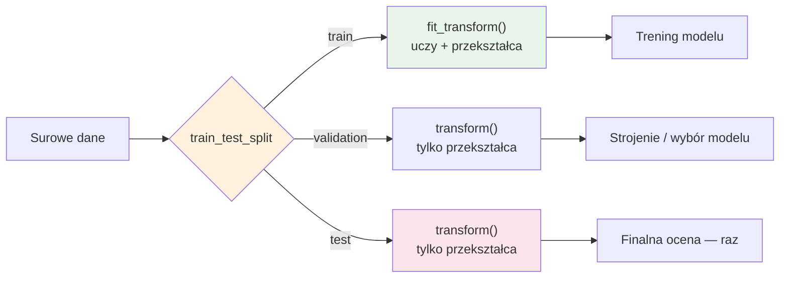
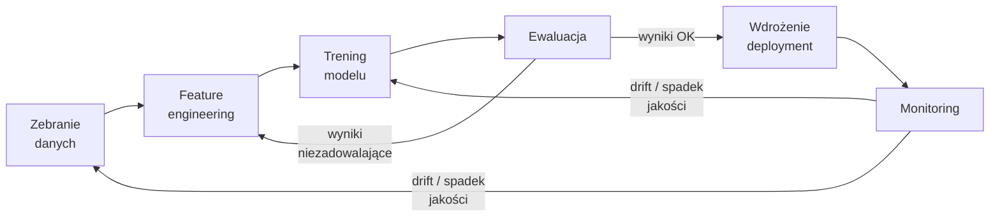

# 5. Przewodnik po Machine Learningu: Trenowanie Modeli w Pythonie

> [!NOTE]
> Python jest niekwestionowanym liderem i *lingua franca* w świecie Machine Learningu (ML). Jego biblioteki oferują spójne i potężne narzędzia do implementacji zarówno klasycznych algorytmów, jak i najnowocześniejszych, głębokich sieci neuronowych. W tej sekcji poznasz kluczowe frameworki, które stanowią fundament pracy każdego specjalisty danych.

---

## 🏛️ [Scikit-Learn](https://scikit-learn.org/): Fundament Klasycznego Machine Learningu

Jeśli dopiero zaczynasz swoją przygodę z uczeniem maszynowym w Pythonie, [**Scikit-Learn**](https://scikit-learn.org/) to absolutnie **najlepszy punkt startu**. To potężna i jednocześnie niezwykle przyjazna biblioteka, która gromadzi w jednym miejscu dziesiątki sprawdzonych algorytmów klasycznego ML.

### Filozofia: Spójny i Prosty Interfejs

Największą siłą [Scikit-Learn](https://scikit-learn.org/) jest ujednolicony interfejs dla wszystkich algorytmów. Niezależnie od tego, czy budujesz model regresji liniowej, las losowy czy system klastrowania, podstawowe kroki są zawsze takie same:

1.  **Inicjalizacja modelu**: `model = RandomForestClassifier()`
2.  **Trenowanie modelu**: `model.fit(X_train, y_train)`
3.  **Przewidywanie na nowych danych**: `predictions = model.predict(X_test)`

Ta spójność drastycznie obniża próg wejścia i pozwala skupić się na zrozumieniu danych i samego problemu, a nie na walce z różnymi API.

### Dokumentacja jako Interaktywny Podręcznik

Dokumentacja [Scikit-Learn](https://scikit-learn.org/) to w praktyce **darmowy, interaktywny podręcznik do podstaw uczenia maszynowego**. Każdy algorytm jest opatrzony nie tylko przykładami kodu, ale również szczegółowymi wyjaśnieniami matematycznymi, intuicjami, zaletami, wadami i najlepszymi praktykami. Jest to nieocenione źródło wiedzy, które będzie Ci towarzyszyć przez długi czas.

### Typowy Cykl Pracy w Scikit-Learn

Poniższy przykład ilustruje klasyczny, kompletny proces budowy i oceny modelu klasyfikacyjnego.

```python
from sklearn.model_selection import train_test_split
from sklearn.ensemble import RandomForestClassifier
from sklearn.metrics import accuracy_score

# Załóżmy, że X to nasze dane (cechy), a y to etykiety (cel)
# X, y = ...

# 1. Podział danych na zbiór treningowy i testowy
# Zbiór treningowy służy do "nauczenia" modelu, a testowy do oceny jego skuteczności
# na danych, których wcześniej nie widział.
X_train, X_test, y_train, y_test = train_test_split(X, y, test_size=0.2, random_state=42)

# 2. Inicjalizacja modelu
# Wybieramy algorytm - w tym przypadku las losowy (RandomForestClassifier).
model = RandomForestClassifier(n_estimators=100)

# 3. Trenowanie modelu
# Metoda .fit() "uczy" model na podstawie danych treningowych.
model.fit(X_train, y_train)

# 4. Przewidywanie na danych testowych
# Używamy wytrenowanego modelu, aby wygenerować predykcje dla zbioru testowego.
predictions = model.predict(X_test)

# 5. Ocena modelu
# Porównujemy predykcje z rzeczywistymi etykietami ze zbioru testowego.
# Metryka accuracy_score mówi nam, jaki procent predykcji był poprawny.
accuracy = accuracy_score(y_test, predictions)
print(f"Dokładność modelu: {accuracy:.4f}")

```

[Scikit-Learn](https://scikit-learn.org/) zapewnia ujednolicony interfejs dla dziesiątek algorytmów, w tym **regresji** (predykcji wartości ciągłych, np. ceny mieszkania), **klasyfikacji** (przypisywania obserwacji do jednej z klas, czyli zbioru dozwolonych odpowiedzi — np. spam/nie-spam) i **klasteryzacji** (uczenia nienadzorowanego: grupowania obiektów bez wcześniej znanych etykiet). To trzy fundamentalne klasy problemów ML, z którymi spotkasz się najczęściej.

> [!NOTE]
> Aktualna wersja stabilna to **scikit-learn 1.8.0** (wspiera Python 3.11–3.14). Biblioteka jest dojrzała i rozwijana ewolucyjnie — API, którego nauczysz się dziś, będzie aktualne za kilka lat. Dla większości problemów na danych tabelarycznych warto zacząć od scikit-learn lub gradient boostingu (patrz niżej), a *nie* od deep learningu.

-----

## 🔥 Deep Learning: PyTorch, Keras 3, TensorFlow i JAX

Gdy wchodzisz w świat **deep learningu** (głębokich sieci neuronowych) — tego, co napędza modele językowe, generację obrazów i nowoczesny computer vision — masz do dyspozycji kilka frameworków. Ich pozycje rynkowe zmieniły się radykalnie w ostatnich latach, dlatego warto poznać aktualny (maj 2026) krajobraz.

> [!IMPORTANT]
> Jeśli znasz tę dziedzinę ze starszych kursów lub książek, prawdopodobnie zaczynano je od TensorFlow i Keras. **To już nieaktualne.** Dziś domyślnym wyborem — zarówno w badaniach, jak i w nowych projektach produkcyjnych — jest **PyTorch**.

### 🏆 [PyTorch](https://pytorch.org/) — domyślny framework deep learningu

[**PyTorch**](https://pytorch.org/) (rozwijany pierwotnie przez Meta AI, dziś pod egidą [PyTorch Foundation](https://pytorch.org/foundation)) to **dziś standardowy wybór dla deep learningu**. Dominuje w środowisku badawczym (szacuje się, że stoi za ok. **85% publikacji naukowych** z ML), jest najczęściej wybierany do nowych projektów i stanowi fundament niemal całego ekosystemu **GenAI** — biblioteka Hugging Face `transformers`, większość open-source'owych LLM oraz narzędzia treningowe domyślnie zakładają PyTorch.

Dlaczego wygrał? Kluczowy był **imperatywny, "pythoniczny" styl** (dynamiczny graf obliczeniowy — *define-by-run*): kod sieci neuronowej wykonuje się jak zwykły kod Pythona, krok po kroku, więc możesz go debugować standardowymi narzędziami i `print`-ami. Dla programisty przychodzącego z C++/Java/C# jest to znacznie bardziej naturalne niż budowanie statycznego grafu "z góry".

Model w PyTorch definiujesz jako klasę dziedziczącą po `nn.Module`:

```python
import torch
from torch import nn

class SimpleClassifier(nn.Module):
    """Prosta sieć w pełni połączona (MLP) do klasyfikacji."""

    def __init__(self, in_features: int, hidden: int, num_classes: int) -> None:
        super().__init__()
        # Warstwy definiujemy w konstruktorze...
        self.net = nn.Sequential(
            nn.Linear(in_features, hidden),
            nn.ReLU(),
            nn.Dropout(0.2),
            nn.Linear(hidden, num_classes),
        )

    def forward(self, x: torch.Tensor) -> torch.Tensor:
        # ...a w metodzie forward() opisujemy przepływ danych.
        # To zwykły kod Pythona — możesz tu wstawić print() czy breakpoint.
        return self.net(x)

model = SimpleClassifier(in_features=64, hidden=128, num_classes=10)
logits = model(torch.randn(32, 64))  # batch 32 próbek
print(logits.shape)  # torch.Size([32, 10])
```

> [!TIP]
> Ekosystem PyTorch jest ważniejszy niż sam framework. Warto znać: **Hugging Face `transformers`** (gotowe modele i pipeline'y), **PyTorch Lightning** (eliminuje boilerplate pętli treningowej), **`torch.compile`** (kompilacja JIT przyspieszająca trening i inferencję) oraz **`torchvision`/`torchaudio`** (dane i modele domenowe).

### 🎨 [Keras 3](https://keras.io/) — wysokopoziomowe API multi-backend

Tu kryje się najczęstsze nieporozumienie. **Keras 3 to NIE jest już `tf.keras`** — czyli moduł "przyklejony" do TensorFlow. Od premiery w listopadzie 2023 **Keras 3 jest frameworkiem multi-backend**: ten sam wysokopoziomowy kod możesz uruchomić na **JAX, PyTorch lub TensorFlow**, przełączając backend jedną zmienną środowiskową.

Keras pozostaje najbardziej przyjaznym, zwięzłym API do budowy i trenowania sieci — świetnym wyborem do szybkiego prototypowania i edukacji. W praktyce **backend JAX zwykle daje najlepszą wydajność** treningu i inferencji na GPU/TPU, więc Keras 3 pozwala łączyć wygodę wysokopoziomowego API z szybkością JAX-a.

### 🏢 [TensorFlow](https://www.tensorflow.org/) — wciąż obecny, ale nie domyślny

[**TensorFlow**](https://www.tensorflow.org/) (Google) był przez lata frameworkiem numer jeden i dzięki tej przewadze czasowej **nadal ma duży udział w systemach enterprise** — wiele wdrożonych pipeline'ów produkcyjnych powstało w TF i działa do dziś. Jest to jednak w 2026 roku w dużej mierze **technologia "legacy"**: do *nowej* pracy badawczej i nowych projektów rzadko bywa pierwszym wyborem.

TensorFlow zachowuje natomiast realne nisze, w których jest mocny: dojrzałe wsparcie **TPU**, produkcyjny ekosystem **TFX** (TensorFlow Extended) do pipeline'ów ML oraz **deployment na urządzeniach brzegowych** (edge) i mobilnych przez **LiteRT** (dawniej TensorFlow Lite).

### ⚡ [JAX](https://docs.jax.dev/) — wysokowydajne obliczenia numeryczne

[**JAX**](https://docs.jax.dev/) (Google) to framework do **wysokowydajnych obliczeń numerycznych i ML**, łączący API w stylu NumPy z automatycznym różniczkowaniem (`grad`), kompilacją JIT (`jit`) i wektoryzacją (`vmap`). Jest szczególnie ceniony w środowisku badawczym (zwłaszcza tam, gdzie liczy się skala i wydajność na TPU) i pełni rolę **najszybszego backendu dla Keras 3**. Dla typowego inżyniera wchodzącego w ML jest to narzędzie "do poznania później" — najpierw PyTorch.

| Framework | Pozycja w 2026 | Kiedy wybrać |
| :--- | :--- | :--- |
| **PyTorch** | Domyślny standard, ~85% badań, fundament GenAI | Nowe projekty, badania, praca z LLM, fine-tuning |
| **Keras 3** | Wysokopoziomowe API multi-backend (JAX/PyTorch/TF) | Szybkie prototypowanie, edukacja, gdy chcesz zwięzłości |
| **JAX** | Wysokowydajne obliczenia, backend Keras 3 | Badania wymagające maksymalnej wydajności, duża skala, TPU |
| **TensorFlow** | Legacy enterprise, duży udział "z rozpędu" | Utrzymanie istniejących systemów, TPU, TFX, edge (LiteRT) |

-----

## 🌳 Gradient Boosting — król danych tabelarycznych

Istnieje powszechne, ale błędne przekonanie, że deep learning jest najlepszy do *wszystkiego*. W praktyce **dla danych tabelarycznych** (klasyczne tabele: wiersze-rekordy, kolumny-cechy — to wciąż najczęstszy format danych w biznesie) **najlepsze wyniki regularnie osiąga gradient boosting**. Benchmarki z lat 2025–2026 wielokrotnie potwierdziły, że biblioteki boostingowe **dorównują lub przewyższają** sieci neuronowe na danych tabelarycznych — przy ułamku kosztu treningu i czasu strojenia.

Gradient boosting to technika **zespołowa** (ensemble): buduje sekwencję płytkich drzew decyzyjnych, gdzie każde kolejne drzewo koryguje błędy poprzednich. Trzy biblioteki dominują:

| Biblioteka | Wersja (maj 2026) | Wyróżnik | Kiedy wybrać |
| :--- | :--- | :--- | :--- |
| [**XGBoost**](https://xgboost.readthedocs.io/) | 3.2 | Sprawdzony, uniwersalny standard | Solidny domyślny wybór, dojrzały ekosystem |
| [**LightGBM**](https://lightgbm.readthedocs.io/) | 4.6 | Najszybszy trening, niskie zużycie pamięci | Duże zbiory danych, gdy liczy się czas |
| [**CatBoost**](https://catboost.ai/) | 1.2.x | Natywna, bardzo dobra obsługa cech kategorycznych | Dane z wieloma kolumnami kategorycznymi |

> [!TIP]
> Praktyczna heurystyka wyboru: **LightGBM**, gdy najważniejsza jest szybkość; **CatBoost**, gdy dane mają dużo cech kategorycznych (oszczędzasz na ręcznym kodowaniu); **XGBoost** jako solidny, uniwersalny środek. Wszystkie trzy oferują interfejs zgodny ze scikit-learn (`.fit()` / `.predict()`).

Przykład — klasyfikator XGBoost ze scikit-learnowym interfejsem:

```python
from xgboost import XGBClassifier
from sklearn.model_selection import train_test_split
from sklearn.metrics import accuracy_score

# X, y = ... (dane tabelaryczne)
X_train, X_test, y_train, y_test = train_test_split(X, y, test_size=0.2, random_state=42)

# Interfejs identyczny jak w scikit-learn — łatwa wymiana modeli.
model = XGBClassifier(
    n_estimators=300,      # liczba drzew
    max_depth=6,           # głębokość pojedynczego drzewa
    learning_rate=0.05,    # tempo uczenia (krok korekty)
    n_jobs=-1,             # wykorzystaj wszystkie rdzenie CPU
)
model.fit(X_train, y_train)

predictions = model.predict(X_test)
print(f"Dokładność: {accuracy_score(y_test, predictions):.4f}")
```

-----

## 🎯 Rygor w praktyce ML — czego nie pominąć

Znajomość bibliotek to dopiero połowa sukcesu. Druga połowa to **metodologia** — zestaw zasad, które decydują, czy Twój model naprawdę działa, czy tylko *wygląda*, że działa. Doświadczony programista wchodzący w ML najczęściej potyka się nie o algorytmy, lecz o ciche błędy metodologiczne. Ta sekcja zbiera minimum, którego nie wolno pominąć.

### Podział danych: train / validation / test

Model **nie może** być oceniany na tych samych danych, na których się uczył — "zapamiętałby" je i wynik byłby zawyżony. Dlatego dane dzielimy na **trzy** zbiory:

* **Treningowy (*train*)** — model się na nim uczy (`.fit()`).
* **Walidacyjny (*validation*)** — służy do strojenia: doboru hiperparametrów, wyboru modelu, decyzji "która wersja lepsza". Patrzysz na niego wielokrotnie.
* **Testowy (*test*)** — **nietknięty do samego końca**. Używasz go *raz*, na finalnym modelu, by uzyskać uczciwą ocenę jakości na nowych danych. Gdy raz "podejrzysz" wynik na teście i na tej podstawie coś zmienisz — test przestaje być testem.

### Data leakage — najczęstszy cichy błąd

**Wyciek danych (*data leakage*)** to sytuacja, w której do treningu przedostaje się informacja, której model nie będzie miał w produkcji. Efekt: świetne wyniki na walidacji/teście i rozczarowanie po wdrożeniu. To najczęstszy i najtrudniejszy do wykrycia błąd początkujących, bo nic się nie "wywala" — model po prostu kłamie na temat swojej jakości. Typowe źródła:

* **Preprocessing dopasowany przed splitem** — przykład: skalujesz lub imputujesz braki na *całym* zbiorze, a *potem* dzielisz na train/test. Statystyki użyte do skalowania (średnia, odchylenie) "widziały" wtedy dane testowe — to wyciek.
* **Cecha z przyszłości** — kolumna zawiera informację niedostępną w chwili predykcji (np. przewidujesz, czy klient zrezygnuje, a jedną z cech jest `data_rezygnacji`). Model "ściąga" z odpowiedzi.

**Reguła:** wszystkie transformacje uczone na danych (skalowanie, imputacja, kodowanie, selekcja cech) dopasowuj **wyłącznie na zbiorze treningowym** (`.fit()` na train), a następnie tylko *aplikuj* (`.transform()`) na walidacji i teście.



> [!WARNING]
> Kolejność ma znaczenie: **najpierw split, dopiero potem `fit`** transformacji. Odwrotna kolejność to klasyczny wyciek danych — wynik na teście będzie zawyżony, a model zawiedzie w produkcji.

### Cross-validation (walidacja krzyżowa)

Pojedynczy podział train/validation bywa "loterią" — wynik zależy od tego, które obserwacje akurat trafiły do walidacji. **K-fold cross-validation** rozwiązuje to: dane treningowe dzieli się na *k* równych części ("foldów"); model trenuje się *k* razy, za każdym razem na *k–1* foldach, a oceniane na pozostałym. Średnia z *k* wyników to stabilniejsza ocena. Stosuj cross-validation przy doborze hiperparametrów i porównywaniu modeli, zwłaszcza gdy zbiór danych jest niewielki. Zbiór testowy nadal trzymasz osobno, poza całą procedurą.

### Metryki poza accuracy

`accuracy` (odsetek poprawnych predykcji) jest intuicyjna, ale **myląca przy niezbalansowanych klasach**. Jeśli 99% maili to nie-spam, model zawsze odpowiadający "nie-spam" ma 99% accuracy — i jest bezużyteczny. Dlatego warto znać:

* **Precision (precyzja)** — spośród obserwacji oznaczonych jako pozytywne, ile *naprawdę* takie było. Ważna, gdy kosztuje **fałszywy alarm** (np. oznaczenie ważnego maila jako spam).
* **Recall (czułość)** — spośród *wszystkich* obserwacji pozytywnych, ile model wychwycił. Ważna, gdy kosztuje **przeoczenie** (np. niewykrycie choroby, oszustwa).
* **F1** — średnia harmoniczna precision i recall; jedna liczba, gdy zależy Ci na obu naraz.
* **ROC-AUC** — ocenia zdolność modelu do *rozróżniania* klas niezależnie od progu decyzyjnego; dobra do porównywania modeli.

> [!NOTE]
> Definicje i intuicje tych metryk (precision, recall, F1, ROC-AUC, accuracy) znajdziesz w [słowniczku](./08-glossary.md). Praktyczna zasada: najpierw zastanów się, *który błąd boli bardziej* — fałszywy alarm czy przeoczenie — i dopiero potem dobierz metrykę.

### Niezbalansowane klasy

Gdy jedna klasa dominuje (oszustwa, rzadkie choroby, awarie), model ma tendencję do ignorowania klasy mniejszościowej. Typowe podejścia: **wagi klas** (`class_weight="balanced"` w wielu modelach scikit-learn — model "karze" mocniej za błędy na rzadkiej klasie) oraz **resampling** (oversampling klasy mniejszościowej, np. SMOTE, lub undersampling większościowej). Zawsze połącz to z odpowiednią metryką — accuracy tu nie wystarczy.

### Pipeline — preprocessing i model jako jeden obiekt

`sklearn.pipeline.Pipeline` spina kroki preprocessingu i model w **jeden obiekt**. To nie kosmetyka — to mechanizm, który **strukturalnie eliminuje data leakage**: wywołanie `.fit()` na pipeline dopasowuje transformacje tylko na danych treningowych, a `.predict()` automatycznie aplikuje je w tej samej kolejności. Upraszcza też wdrożenie (zapisujesz i ładujesz jeden artefakt) i poprawnie współpracuje z cross-validation.

```python
from sklearn.pipeline import Pipeline
from sklearn.preprocessing import StandardScaler
from sklearn.impute import SimpleImputer
from sklearn.ensemble import RandomForestClassifier
from sklearn.model_selection import train_test_split

X_train, X_test, y_train, y_test = train_test_split(
    X, y, test_size=0.2, random_state=42
)

# Preprocessing + model w jednym obiekcie.
pipeline = Pipeline([
    ("imputer", SimpleImputer(strategy="median")),  # uzupełnienie braków
    ("scaler", StandardScaler()),                   # skalowanie cech
    ("model", RandomForestClassifier(random_state=42)),
])

# .fit() dopasowuje imputer i scaler TYLKO na danych treningowych —
# brak ryzyka wycieku danych.
pipeline.fit(X_train, y_train)

# .predict() automatycznie aplikuje imputer i scaler na danych testowych.
predictions = pipeline.predict(X_test)
```

### Reprodukowalność

Wiele algorytmów ML zawiera losowość (podział danych, inicjalizacja wag, bootstrapping w lasach losowych). Bez kontroli każdy uruchom da inny wynik — debugowanie i porównywanie eksperymentów staje się niemożliwe. **Ustawiaj ziarno losowości** (`random_state` w scikit-learn, `seed` w innych bibliotekach) wszędzie tam, gdzie występuje losowość — w `train_test_split`, w modelu, w procedurach cross-validation. Dzięki temu wynik jest powtarzalny, a eksperymenty — porównywalne.

> [!TIP]
> Te zasady to nie biurokracja, lecz różnica między modelem, który działa na slajdzie, a modelem, który działa w produkcji. Jeśli zapamiętasz tylko jedno: **najpierw podziel dane, potem rób cokolwiek innego** — i dopasowuj transformacje wyłącznie na zbiorze treningowym.

-----

## 🔁 Typowy Cykl Życia Projektu ML

Trening modelu to tylko jeden z etapów. Niezależnie od wybranego frameworka, projekt ML w produkcji to **iteracyjny cykl**, a nie liniowy proces — model po wdrożeniu z czasem się "starzeje" (zjawisko *model/data drift*), co wymusza powrót do wcześniejszych etapów.



Ten cykl pokazuje, dlaczego ML to nie "wytrenuj i zapomnij", lecz ciągły proces — i dlaczego potrzebne są narzędzia MLOps.

-----

## 🚀 MLOps — od notebooka do produkcji

Wytrenowanie modelu w notebooku Jupyter to dopiero początek. **MLOps** (Machine Learning Operations) to zbiór praktyk i narzędzi, które przenoszą model z eksperymentu do niezawodnej produkcji: śledzenie eksperymentów, wersjonowanie modeli i danych, automatyzacja wdrożeń oraz monitoring.

* [**MLflow**](https://mlflow.org/) (wersja **3.10**, marzec 2026) — najpopularniejsza, otwarta platforma do zarządzania cyklem życia ML: śledzenie eksperymentów (parametry, metryki, artefakty), rejestr modeli i pakowanie wdrożeń. Co istotne, **MLflow 3.x wyszedł daleko poza klasyczny ML** — oferuje dziś **observability dla agentów GenAI**: tracing wywołań LLM, ewaluację jakości odpowiedzi i śledzenie kosztów (*cost tracking*). To czyni go uniwersalnym narzędziem zarówno dla klasycznego ML, jak i aplikacji GenAI.
* [**Weights & Biases**](https://wandb.ai/) (W&B) — popularne, dopracowane narzędzie do śledzenia eksperymentów, wizualizacji metryk i współpracy zespołowej; szczególnie lubiane w środowisku deep learningu i badaniach.
* [**ZenML**](https://www.zenml.io/) i [**Neptune**](https://neptune.ai/) — kolejne warte poznania narzędzia: ZenML to framework do budowy przenośnych pipeline'ów MLOps, Neptune to rozbudowany rejestr i tracker eksperymentów (ceniony przy trenowaniu modeli foundation).
* [**ONNX Runtime**](https://onnxruntime.ai/) — uniwersalny standard **inferencji**. [ONNX](https://onnx.ai/) (Open Neural Network Exchange) to otwarty format zapisu modeli, niezależny od frameworka: model wytrenowany w PyTorch możesz wyeksportować do ONNX i uruchamiać go przez ONNX Runtime na różnych platformach (CPU, GPU, edge) z wysoką wydajnością. Daje to **przenośność** — odseparowanie środowiska treningu od środowiska produkcyjnego.

> [!NOTE]
> Dla aplikacji GenAI (agenci, RAG) tracing i ewaluacja są równie ważne jak w klasycznym ML — więcej o monitorowaniu i architekturze takich systemów znajdziesz w rozdziale [6. Aplikacje GenAI i RAG](./06-generative-ai-and-rag.md) oraz w [7. Architektura i dobre praktyki](./07-architecture-and-good-practices.md). Definicje pojęć (drift, inferencja, ensemble) zebrano w [słowniczku](./08-glossary.md).