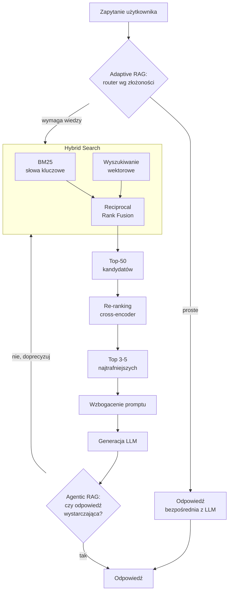
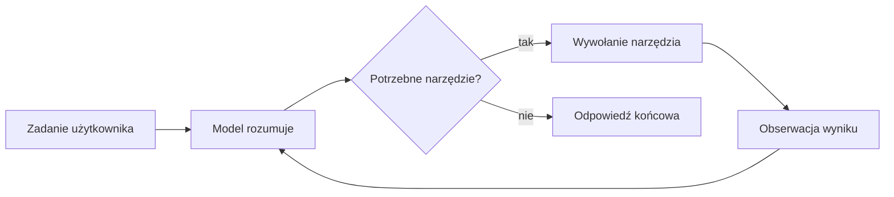
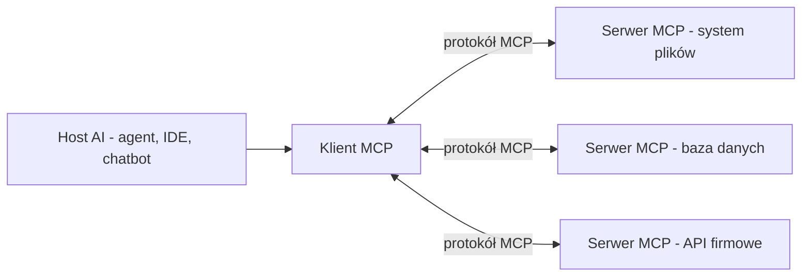

# 6. Aplikacje GenAI i RAG: Budowanie Inteligentnych Systemów

> [!NOTE]
> Generatywna Sztuczna Inteligencja (Generative AI) to najnowsza i najszybciej rozwijająca się gałąź ekosystemu Pythona. Jest to ewolucja poddziedziny Machine Learninu - NLP (ang. *Natural Language Processing*, czyli przetwarzanie języka naturalnego). Zrozumienie podstaw działania modeli językowych (LLM) oraz kluczowych wzorców architektonicznych, takich jak RAG, jest niezbędne do budowania nowoczesnych, rzetelnych i wartościowych aplikacji AI.

---

## 🧠 Czym są Duże Modele Językowe (LLM)?

W najprostszym ujęciu, duży model językowy (LLM) to głęboka sieć neuronowa (ang. *"Deep Neural Network"*) wytrenowana na ogromnych ilościach danych tekstowych (nazywanych *"datasetem"* czy *"corpusem"*). Jej podstawowym zadaniem jest **przewidywanie następnego słowa (a dokładniej: `tokenu`) w sekwencji**. Ta z pozoru prosta zdolność, przeskalowana do miliardów parametrów i terabajtów danych treningowych, prowadzi do wyłaniania się (ang. *emergence*) złożonych zachowań, takich jak odpowiadanie na pytania, tłumaczenie, streszczanie tekstów czy pisanie kodu.

### Polecane zasoby do głębszego zrozumienia

Aby efektywnie pracować z LLM, warto zrozumieć, co dzieje się "pod maską". Poniższe materiały są absolutnie najlepszym punktem startowym.

* **Teoria dla każdego (Intuicja wizualna)**: Jeśli chcesz zrozumieć, jak naprawdę działa deep learning i modele językowe AI, koniecznie zobacz serię [**3Blue1Brown o sieciach neuronowych**](https://www.youtube.com/playlist?list=PLZHQObOWTQDNU6R1\_67000Dx\_ZCJB-3pi). To jedne z najlepszych istniejących materiałów, które w sposób wizualny i przystępny tłumaczą podstawowe idee stojące za nowoczesnymi modelami AI i machine learningiem. Idealne na start, by zbudować intuicję i "poczuć" jak myśli sieć neuronowa oraz (dalej) modele językowe.

* **Wszystko w jednym wykładzie**: Wykład [***Andrieja Karpathy'ego* *"Intro to Large Language Models"***](https://www.youtube.com/watch?v=zjkBMFhNj_g) to jedno z lepszych wprowadzeń w temat, jakie istnieje. Karpathy, jako jeden z czołowych ekspertów w dziedzinie, w przystępny sposób wyjaśnia architekturę Transformerów, proces treningu i skalowania - wszystko w formie jednego, długiego i interaktywnego wykładu.

* **Bieżące nowości**: Świat GenAI zmienia się z tygodnia na tydzień. Kanał YouTube [**bycloud**](https://www.youtube.com/@bycloudAI) to doskonałe źródło podsumowań najnowszych prac badawczych i przełomowych modeli, prezentowanych w technicznym, ale zrozumiałym, atrakcyjnym wizualnie formacie.

---

## 🗺️ Krajobraz Modeli (stan na maj 2026)

Rynek modeli językowych zmienia się ekstremalnie szybko. Poniższe zestawienie jest aktualne na **maj 2026**, ale potraktuj je jako migawkę.

> [!IMPORTANT]
> Konkretne numery wersji dezaktualizują się w ciągu tygodni. Jako inżynier myśl raczej kategoriami **rodzin modeli** i ich **zdolności** (długość kontekstu, multimodalność, tryb rozumowania, koszt, latencja) niż konkretnych nazw. Architektura Twojej aplikacji powinna pozwalać na wymianę modelu bez przepisywania logiki - patrz wzorzec *Ports & Adapters* w rozdziale [7. Architektura i dobre praktyki](./07-architecture-and-good-practices.md).

> [!NOTE]
> Krajobraz modeli zmienia się z tygodnia na tydzień. Aktualne porównania wydajności i kosztów znajdziesz na [LMSYS Chatbot Arena](https://lmarena.ai/) oraz [Artificial Analysis](https://artificialanalysis.ai/). Poniższe zestawienie jest aktualne na maj 2026 – potraktuj je jako migawkę, nie jako stałą prawdę.

### Modele zamknięte (frontier, dostępne przez API)

| Dostawca | Rodzina | Najnowszy model (maj 2026) | Uwagi |
| :--- | :--- | :--- | :--- |
| **OpenAI** | GPT-5 | **GPT-5.5**[^gpt55] | Flagowa rodzina, silne rozumowanie i tool use |
| **Anthropic** | Claude 4.x (Opus / Sonnet) | **Claude Opus 4.7**[^opus47] | Mocne w kodowaniu i pracy agentowej, długi kontekst |
| **Google** | Gemini 3 | **Gemini 3.1 Pro**[^gemini31] | Tryb *Deep Think* (rozszerzone rozumowanie), multimodalność |
| **xAI** | Grok 4 | **Grok 4.3** | Integracja z ekosystemem X, dostęp do danych w czasie rzeczywistym |

[^gpt55]: GPT-5.5 - wydany 23 kwietnia 2026 r.; najnowszy model rodziny GPT-5.
[^opus47]: Claude Opus 4.7 - wydany 16 kwietnia 2026 r.; najmocniejszy model rodziny Claude 4.x.
[^gemini31]: Gemini 3.1 Pro - model rodziny Gemini 3 z trybem rozszerzonego rozumowania *Deep Think*.

### Modele open-weight (otwarte wagi, możliwy self-hosting)

Obok modeli zamkniętych dynamicznie rozwija się ekosystem modeli **open-weight** - takich, których wagi są publicznie dostępne i które możesz uruchomić **na własnej infrastrukturze**. To kluczowe dla zastosowań wymagających suwerenności danych, niskiej latencji lub kontroli kosztów.

* **Meta [Llama 4](https://www.llama.com/)** - rodzina (warianty *Scout* i *Maverick*) w architekturze **MoE** z ekstremalnie długim oknem kontekstu.

* **[DeepSeek](https://www.deepseek.com/) V4** (wersja zapoznawcza) - kolejna generacja wysoko ocenianych modeli o bardzo dobrym stosunku jakości do kosztu.

* **Alibaba [Qwen](https://qwen.ai/)3** - silna, wielojęzyczna rodzina z dobrymi wariantami wyspecjalizowanymi (m.in. kodowanie).

* **Google [Gemma 3](https://ai.google.dev/gemma)** - otwarta rodzina Google, dobrze dopasowana do uruchamiania lokalnego.

* **[Mistral](https://mistral.ai/)** - europejski dostawca z portfolio wydajnych modeli open-weight.

> [!NOTE]
> **Architektura MoE.** Wiele flagowych modeli open-weight w 2026 wykorzystuje architekturę **Mixture-of-Experts (MoE)** - "sparse" - m.in. **Llama 4** czy modele **DeepSeek**. Model składa się z wielu wyspecjalizowanych podsieci ("ekspertów"), ale dla każdego tokenu router aktywuje tylko niewielki ich podzbiór. Dzięki temu model może mieć setki miliardów parametrów *całkowitych*, ale koszt obliczeniowy pojedynczego tokenu odpowiada znacznie mniejszemu modelowi. To kluczowy kompromis: jakość dużego modelu przy koszcie inferencji małego.
>
> **To jednak nie reguła bez wyjątków.** MoE nie jest "domyślną" architekturą wszystkich flagowych modeli - wciąż istnieją wydajne i konkurencyjne modele **dense** (wszystkie parametry aktywne dla każdego tokenu), zwłaszcza w mniejszych rozmiarach przeznaczonych do uruchamiania lokalnego. Wybierając model, patrz na jego rzeczywiste parametry i charakterystykę, nie zakładaj architektury z góry.

---

## ✅ Mocne i Słabe Strony LLM-ów

Jako inżynier musisz traktować LLM jak każde inne narzędzie – ze świadomością jego zalet i ograniczeń. Myślenie o LLM jako o "magicznej czarnej skrzynce" prowadzi do frustracji i zawodnych aplikacji.

> [!IMPORTANT]
> **Niedeterministyczność LLM-ów: Kluczowe Wyzwanie dla Inżynierów**
> 
> W przeciwieństwie do tradycyjnych programów komputerowych, LLM-y są **niedeterministyczne** - oznacza to, że ten sam prompt może wygenerować różne odpowiedzi przy każdym wywołaniu, czy przy podaniu tego samego zbioru danych w innym formacie. Ta fundamentalna różnica ma ogromne konsekwencje dla budowy aplikacji produkcyjnych:
>
> **Dlaczego tak się dzieje?**
> - **Sampling podczas generowania**: LLM-y nie wybierają "najlepszego" następnego słowa, lecz **losują** z rozkładu prawdopodobieństwa wszystkich możliwych tokenów
> - **Parametr `temperature`**: Skaluje rozkład prawdopodobieństwa, z którego losowany jest następny token. Wyższa wartość (np. 0.8) "spłaszcza" rozkład i zwiększa losowość oraz różnorodność odpowiedzi; niższa (np. 0.1) "wyostrza" rozkład - model niemal zawsze wybiera najbardziej prawdopodobny token, więc odpowiedzi są bardziej powtarzalne. **Uwaga na częsty błąd:** niska temperatura *nie* oznacza, że model "trzyma się przytoczonego kontekstu" - to dwa zupełnie różne zjawiska. `temperature` dotyczy *samplingu* (jak losujemy token), a wierność wobec dostarczonego kontekstu (*grounding*) zależy od jakości promptu, RAG i instrukcji - nie od temperatury. Można mieć niedeterministyczny model, który ściśle trzyma się faktów, i deterministyczny, który halucynuje.
> - **Floating-point arithmetic**: Nawet przy identycznych parametrach, mikroskopijne różnice w obliczeniach mogą prowadzić do innych wyników
>
> **Praktyczne konsekwencje dla aplikacji:**
> - **Testowanie**: Nie możesz napisać prostego testu jednostkowego "input X → output Y", bo output może się różnić. **Nie oznacza to jednak, że testy powinny być domyślnie "kierowane" przez inny model językowy** - to częsty antywzorzec u początkujących (kosztowny, wolny i sam w sobie niedeterministyczny). Hierarchia podejść jest następująca:
>   1. **Mocki / stuby dostawcy LLM** - w testach jednostkowych i integracyjnych podmieniasz prawdziwego dostawcę na atrapę zwracającą deterministyczne, zapisane odpowiedzi. Testujesz wtedy *własną logikę* (parsowanie, walidację, obsługę błędów), a nie sam model.
>   2. **Testy kontraktowe** - sprawdzasz, że Twój kod poprawnie współpracuje z *kontraktem* API dostawcy (kształt żądania i odpowiedzi), niezależnie od treści generacji.
>   3. **Walidacja schematu odpowiedzi** - wymuszasz strukturę outputu (Pydantic, *structured outputs*) i testujesz deterministycznie, że odpowiedź da się zwalidować; niepoprawny kształt to twardy błąd.
>   4. **Deterministyczne fixture'y** - zestaw zapisanych par wejście→odpowiedź modelu, na których testujesz przetwarzanie bez odpytywania API.
>   5. **Regresyjne zestawy ewaluacyjne (*eval sets*)** - curated zbiór reprezentatywnych przypadków, uruchamiany przy zmianie modelu lub promptu, by wykryć regresje jakości.
> - **LLM-as-judge - technika *pomocnicza***: użycie modelu do *oceny jakości* odpowiedzi (np. trafności, spójności) na curated zbiorze ewaluacyjnym jest uzasadnione tam, gdzie nie da się napisać reguły. Ale to narzędzie do **ewaluacji jakości, a nie zamiennik testów jednostkowych i integracyjnych** - traktuj je jako uzupełnienie powyższej hierarchii, nigdy jako jej podstawę.
> - **Reprodukowalność**: Debugowanie staje się trudniejsze - błąd może wystąpić raz na 10 prób
> - **Konsystentność UX**: Użytkownicy mogą być zdezorientowani różnymi odpowiedziami na identyczne pytania
>
> **Strategie radzenia sobie z niedeterministycznością:**
> - **Seed**: Niektóre API pozwalają ustawić `seed` dla większej powtarzalności (choć nie gwarantuje 100% identycznych wyników)
> - **Multiple sampling**: Wygeneruj kilka odpowiedzi i wybierz najlepszą lub znajdź wspólne elementy
> - **Structured outputs**: Użyj Pydantic/BAML do wymuszenia konkretnego formatu, co ogranicza przestrzeń możliwych odpowiedzi
> - **Prompt engineering**: Precyzyjne instrukcje i przykłady (few-shot learning) zwiększają spójność
> - **Post-processing**: Dodaj walidację i normalizację wygenerowanych odpowiedzi

| Obszar Zastosowań | Mocne Strony (w czym są dobre) | Słabe Strony / Ograniczenia (gdzie zawodzą) | Strategie Mitygacji (Jak sobie z tym radzić?) |
| :--- | :--- | :--- | :--- |
| **Analiza Danych Niestrukturalnych** | Doskonałe w rozumieniu i przetwarzaniu języka naturalnego: streszczanie tekstów, analiza sentymentu, kategoryzacja, odpowiadanie na pytania oparte na tekście. | Mogą gubić niuanse i kontekst w bardzo długich lub skomplikowanych dokumentach. | Precyzyjne promptowanie (np. Chain-of-Thought), przetwarzanie dokumentów fragmentami (map-reduce), fine-tuning na danych dziedzinowych. |
| **Wiedza i Fakty** | Posiadają ogromną, szeroką wiedzę ogólną zakodowaną w swoich parametrach podczas treningu. | **Halucynacje**: generowanie wiarygodnie brzmiących, ale fałszywych informacji. **Wiedza odcięta w czasie**: model nie zna wydarzeń po zakończeniu jego treningu. | **Retrieval-Augmented Generation (RAG)**, aby uziemić odpowiedzi w konkretnych, aktualnych źródłach danych. Integracja z zewnętrznymi API (np. wyszukiwarką). |
| **Rozumowanie i Obliczenia** | **Modele rozumujące (2026) są tu znacznie lepsze niż modele z 2023** - radzą sobie z wieloetapową logiką i niejednym zadaniem matematycznym. | Model **nie jest kalkulatorem**: do obliczeń wymagających dokładności (arytmetyka, przetwarzanie danych liczbowych) wciąż bywa zawodny i może popełnić cichy błąd. | **Tool Use (Użycie Narzędzi)**: do precyzyjnych obliczeń nie polegaj na "intuicji" modelu - daj mu narzędzia (kalkulator, wykonanie kodu Pythona). Rozumowanie zostaw modelowi, *liczenie* - narzędziu. |
| **Strukturyzacja Danych** | Potrafią generować dane w formatach strukturalnych, takich jak JSON czy XML, na podstawie tekstu. | **Niska niezawodność**: często generują niepoprawny składniowo JSON, pomijają pola, mylą typy danych, zwłaszcza przy złożonych schematach. | **Wymuszanie schematu odpowiedzi**: Użycie bibliotek takich jak **Pydantic** lub **BAML** do zdefiniowania ścisłego schematu wyjściowego i walidacji odpowiedzi modelu. |

---

## 📚 Czym jest RAG (Retrieval-Augmented Generation)?

**RAG** to obecnie najważniejszy wzorzec architektoniczny w budowie rzetelnych aplikacji opartych na LLM. W prostych słowach, RAG zmienia zadanie z "egzaminu z pamięci" na **"egzamin z otwartą książką"**.

Zamiast polegać wyłącznie na wiedzy "zamrożonej" w parametrach modelu, proces RAG wygląda następująco:

1.  **Retrieval (Wyszukanie)**: Gdy użytkownik zadaje pytanie, system najpierw przeszukuje zewnętrzną bazę wiedzy (np. Twoją firmową dokumentację, bazę produktów) w poszukiwaniu najbardziej relevantnych fragmentów informacji.
2.  **Augmentation (Wzbogacenie)**: Znalezione fragmenty są dołączane do oryginalnego zapytania użytkownika jako kontekst, tworząc nowy, wzbogacony prompt.
3.  **Generation (Generowanie)**: Ten wzbogacony prompt jest wysyłany do LLM, który ma teraz wszystkie potrzebne informacje, aby wygenerować precyzyjną, opartą na faktach odpowiedź.

**Dlaczego to jest kluczowe?** RAG bezpośrednio rozwiązuje dwa największe problemy LLM w zastosowaniach biznesowych: **halucynacje** i **nieaktualną wiedzę**. Model jest "uziemiony" (ang. *grounded*) w konkretnych, zaufanych danych.

### Naiwny RAG to dopiero początek

Opisany wyżej schemat (wyszukaj → dołącz → generuj) to tzw. **naiwny RAG** (*naive RAG*). Działa na demach, ale w produkcji szybko zawodzi: czyste wyszukiwanie wektorowe gubi dopasowania słów kluczowych, zwraca zbyt dużo nietrafionych fragmentów, a pytania wymagające łączenia wielu źródeł ("multi-hop") pozostają bez dobrej odpowiedzi. Dlatego nowoczesny RAG to **pipeline z kilkoma etapami poprawiającymi jakość retrievalu**.

### Nowoczesne techniki RAG

* **Hybrid search (wyszukiwanie hybrydowe)** - łączy klasyczne wyszukiwanie leksykalne **BM25** (dopasowanie słów kluczowych, świetne dla nazw własnych, kodów, akronimów) z **wyszukiwaniem wektorowym** (podobieństwo semantyczne). Wyniki obu metod scala się zwykle przez **Reciprocal Rank Fusion (RRF)** - algorytm łączący rankingi na podstawie pozycji, a nie surowych wyników. Hybryda jest niemal zawsze lepsza niż każda z metod osobno.

* **Re-ranking** - wyszukiwanie wektorowe jest szybkie, ale niezbyt precyzyjne. Schemat dwuetapowy: najpierw tani retrieval pobiera szeroką listę (np. **top-50**), następnie **cross-encoder** (model oceniający parę zapytanie–dokument *razem*, dokładniej niż porównanie embeddingów) przesortowuje ją i wybiera **3–5 najtrafniejszych** fragmentów, które trafiają do LLM. Mniej, ale lepszego kontekstu = mniej halucynacji i niższy koszt.

* **Agentic RAG** - retrieval nie jest jednorazowy. Wokół niego buduje się **pętlę rozumowania**: agent analizuje pobrane fragmenty, ocenia, czy wystarczają, w razie potrzeby przeformułowuje zapytanie, dzieli pytanie na pod-pytania i ponawia wyszukiwanie. To RAG, który "myśli", zamiast wykonywać sztywny pipeline.

* **GraphRAG** - zamiast (lub obok) bazy wektorowej wykorzystuje **graf wiedzy**. Sprawdza się przy pytaniach **multi-hop**, wymagających połączenia faktów z wielu dokumentów ("Którzy klienci firmy X są też dostawcami firmy Y?"). Warto znać [**Microsoft GraphRAG**](https://github.com/microsoft/graphrag) oraz jego lżejszy wariant **[LazyGraphRAG](https://github.com/microsoft/graphrag)**, który drastycznie obniża koszt indeksowania, budując strukturę grafu dopiero w momencie zapytania.

* **Adaptive RAG** - nie każde pytanie wymaga pełnego pipeline'u. Lekki **klasyfikator routuje zapytanie** wg złożoności: proste pytania trafiają wprost do LLM, średnie - do zwykłego retrievalu, złożone - do agentic RAG lub GraphRAG. Optymalizuje to koszt i latencję.

> [!TIP]
> Nie wdrażaj wszystkich technik naraz. Zacznij od naiwnego RAG, zmierz jakość, a potem dokładaj etapy tam, gdzie widać problemy: gubione słowa kluczowe → hybrid search; nietrafiony kontekst → re-ranking; pytania multi-hop → GraphRAG.

### Modele embeddingów - fundament retrievalu

Jakość RAG zaczyna się od jakości **embeddingów** - to model embeddingów decyduje, czy semantycznie podobne teksty wylądują blisko siebie w przestrzeni wektorowej. Wybór modelu embeddingowego ma często większy wpływ na jakość niż wybór LLM-a generującego odpowiedź.

| Model | Dostawca | Charakterystyka |
| :--- | :--- | :--- |
| **Gemini Embedding** | Google | Multimodalny (tekst, obraz), mocne wyniki w benchmarkach |
| **Voyage 4** (rodzina) | Voyage AI | Częsty wybór poważnych zespołów RAG; warianty wyspecjalizowane (kod, finanse, prawo) |
| **embed-v4.0** | Cohere | Bardzo dobre wsparcie wielojęzyczne |
| **BGE-M3** | BAAI (open-source) | Wielojęzyczny, otwarty - możliwy self-hosting |
| **text-embedding-3-large** | OpenAI | Wciąż szeroko używany, ale w benchmarkach 2026 wypada słabiej niż tańsze alternatywy |

> [!NOTE]
> Definicje pojęć (embedding, cross-encoder, BM25, knowledge graph) znajdziesz w [słowniczku](./08-glossary.md).

---

## 📝 Prompt Engineering: Sztuka Rozmowy z LLM

**Prompt engineering** to praktyka projektowania i optymalizowania zapytań (promptów) do modeli językowych, aby uzyskać jak najlepsze, najbardziej spójne i użyteczne odpowiedzi. To kluczowa umiejętność każdego inżyniera GenAI – od jakości promptu zależy nie tylko trafność odpowiedzi, ale też bezpieczeństwo, powtarzalność i niezawodność całej aplikacji.

### Najważniejsze techniki promptowania

Poniżej znajdziesz najważniejsze techniki, które warto znać i stosować w praktyce (szczegółowe przykłady i omówienia znajdziesz na [Prompting Guide](https://www.promptingguide.ai/techniques)):

- **Zero-shot prompting** – po prostu zadajesz pytanie lub wydajesz polecenie bez dodatkowych przykładów.

- **Few-shot prompting** – podajesz kilka przykładów poprawnych odpowiedzi, aby model "nauczył się" wzorca.

- **Chain-of-Thought (CoT)** – prosisz model, by rozwiązywał zadanie krok po kroku. Technika historycznie przełomowa (2022–2024): ujawnienie "toku rozumowania" wyraźnie poprawiało trafność na zadaniach wymagających logiki. **Uwaga na nieaktualną poradę produkcyjną:** w 2026, w erze **modeli rozumujących (*reasoning models*)**[^reasoning-models], wymuszanie długiego, jawnego "toku myślenia" *w każdej odpowiedzi* nie jest już dobrą praktyką - zwiększa koszt i latencję, a samą odpowiedź zaszumia. Lepiej: (a) **użyć modelu rozumującego**, który prowadzi rozumowanie wewnętrznie, albo (b) poprosić o **zwięzłe uzasadnienie, plan lub wynik z kontrolą kroków** zamiast rozwlekłego monologu. CoT pozostaje ważnym pojęciem edukacyjnym i bywa przydatny przy słabszych/mniejszych modelach - ale w produkcji stosuj go świadomie, nie odruchowo.

- **Role prompting** – nadajesz modelowi rolę (np. "Jesteś ekspertem od prawa podatkowego...").

- **Instruction-based prompting** – bardzo precyzyjne, jasne instrukcje, często z określeniem formatu odpowiedzi.

- **Reflexion/self-correction** – prosisz model, by sam ocenił i poprawił swoją odpowiedź.

- **Structured output prompting** – wymuszasz konkretny format odpowiedzi (np. JSON, tabela, lista punktów).

Więcej technik i praktycznych przykładów znajdziesz na stronie: [https://www.promptingguide.ai/techniques](https://www.promptingguide.ai/techniques)

### Dobre praktyki i typowe błędy

- Formułuj polecenia jasno, jednoznacznie i bez niedopowiedzeń.

- Unikaj zbyt ogólnych pytań – im bardziej szczegółowy prompt, tym lepsza odpowiedź.

- Testuj różne warianty promptów i porównuj wyniki.

- W przypadku złożonych zadań – dziel je na mniejsze kroki (dekompozycja problemu).

- Wymuszaj format odpowiedzi, jeśli to możliwe (np. "Zwróć wynik jako JSON z polami: ...").

- Używaj przykładów (few-shot), gdy zależy Ci na powtarzalności i spójności.

Typowe błędy:
- Zbyt ogólne lub nieprecyzyjne polecenia.

- Brak określenia formatu odpowiedzi.

- Zbyt długie prompty (model może "zgubić" kontekst).

- Brak testowania różnych wariantów.

### Narzędzia wspierające inżynierię promptów

- [**Instructor**](https://python.useinstructor.com/prompting/) – biblioteka do wymuszania struktury odpowiedzi LLM, bardzo podobna do BAML, ale oparta o [Pydantic](https://docs.pydantic.dev/latest/). Pozwala łatwo wymusić, by model zwracał dane w określonym schemacie (np. klasie Pydantic), co znacznie zwiększa niezawodność i bezpieczeństwo aplikacji.

* [**BAML (Basically a Made-up Language)**](https://docs.boundaryml.com/home): BAML to specjalistyczny język dziedzinowy (DSL, ang. *"Domain Specific Language"*) zaprojektowany do generowania **ustrukturyzowanych odpowiedzi z LLM** – z naciskiem na najlepsze doświadczenie deweloperskie. Pozwala budować niezawodnych agentów, chatboty z RAG, ekstrakcję danych z PDF i wiele więcej. BAML w znacznej części eliminuje typowe problemy pracy z promptami (brak type safety, konieczność ręcznego testowania, trudności z walidacją) i pozwala skupić się na logice biznesowej, a nie na walce z formatem odpowiedzi modelu.

- **Pydantic** – kluczowy komponent do walidacji i wymuszania schematów odpowiedzi w Pythonie.

**Więcej o Instructor i praktycznych przykładach znajdziesz tu:** [https://python.useinstructor.com/prompting/](https://python.useinstructor.com/prompting/)

> [!NOTE]
> **Wybór narzędzia do structured outputs:** [Instructor](https://python.useinstructor.com/) to najprostsza opcja – opakowuje istniejący SDK dostawcy i wymusza schemat Pydantic z automatycznym retry. [BAML](https://docs.boundaryml.com/home) oferuje własny DSL i lepsze DX przy złożonych promptach, ale wymaga dodatkowego kroku budowy. Czysty [Pydantic](https://docs.pydantic.dev/) daje pełną kontrolę, ale sam nie wywołuje LLM – łączy się go z SDK dostawcy ręcznie lub przez Instructor.

---

## 🗄️ Bazy Wektorowe: Sercem nowoczesnych aplikacji GenAI i RAG

Bazy wektorowe to wyspecjalizowane systemy bazodanowe do przechowywania i szybkiego wyszukiwania tzw. wektorów osadzeń (*embeddings*), czyli liczbowych reprezentacji tekstu, obrazów czy innych danych. Są one niezbędne w architekturze RAG, gdzie umożliwiają błyskawiczne znajdowanie najbardziej podobnych fragmentów wiedzy do zapytania użytkownika.

**Najważniejsze bazy wektorowe wykorzystywane w 2026 roku:**

- [**pgvector**](https://github.com/pgvector/pgvector) – rozszerzenie do PostgreSQL. ⭐ **Rozsądny domyślny wybór dla większości projektów** (workloady poniżej ~10 mln wektorów): trzymasz wektory obok danych relacyjnych, bez wprowadzania osobnego systemu do utrzymania (patrz szerszy opis niżej).

- [**Qdrant**](https://qdrant.tech/) – szybka, open-source’owa baza napisana w Rust. ⭐ **Lider open-source pod względem stosunku wydajności do kosztu** - bardzo dobry wybór, gdy potrzebujesz dedykowanej bazy wektorowej i chcesz uniknąć vendor lock-inu.

- [**Weaviate**](https://weaviate.io/) – open-source’owa baza z bogatym API, **szczególnie mocna w wyszukiwaniu hybrydowym** (wektorowym + tekstowym BM25) oraz integracją z popularnymi narzędziami AI.

- [**Pinecone**](https://www.pinecone.io/) – w pełni zarządzana, skalowalna baza wektorowa, szeroko stosowana w produkcyjnych systemach GenAI; wybierana, gdy zależy Ci na braku obsługi infrastruktury.

- [**Milvus**](https://milvus.io/) – bardzo wydajna, open-source’owa baza, skalująca się do miliardów wektorów, z szerokim wsparciem dla różnych przypadków użycia (RAG, wyszukiwanie obrazów, rekomendacje).

- [**Chroma**](https://trychroma.com/) – lekka, open-source’owa baza, często wykorzystywana w prototypowaniu i mniejszych projektach.

- [**Redis**](https://redis.io/docs/interact/search-and-query/search/vectors/) – popularna baza NoSQL z modułem do wyszukiwania wektorowego.

- [**FAISS**](https://github.com/facebookresearch/faiss) – biblioteka Facebooka do wyszukiwania podobieństw w dużych zbiorach wektorów, często używana jako silnik pod spodem innych rozwiązań.

- [**Vespa**](https://vespa.ai/) – platforma do wyszukiwania i rekomendacji z natywnym wsparciem dla wektorów.

**Dodatkowo, coraz większą rolę odgrywają:**
- [**Elasticsearch**](https://www.elastic.co/) – najpopularniejsza na świecie baza do wyszukiwania tekstowego, która od wersji 8.x natywnie wspiera wyszukiwanie wektorowe (HNSW, ANN, hybrydowe zapytania, integracja z Lucene, wsparcie dla GPU, kompresja, skalowalność, bezpieczeństwo, szeroka dokumentacja). Elasticsearch pozwala łączyć klasyczne wyszukiwanie pełnotekstowe z semantycznym, co jest kluczowe w nowoczesnych aplikacjach RAG. [Więcej: blog Elastic](https://www.elastic.co/search-labs/blog/elasticsearch-lucene-vector-database-gains)

- [**LanceDB**](https://lancedb.com/) – nowoczesna, open-source’owa baza zoptymalizowana pod multimodalne AI (tekst, obrazy, audio). Wyróżnia się bardzo wydajnym, kolumnowym formatem danych (Lance), wsparciem dla indeksów IVF+PQ, HNSW, pełnotekstowego wyszukiwania, hybrydowych zapytań, wersjonowania i integracji z Pandas, DuckDB, PyArrow. LanceDB jest lekka, szybka, pozwala na pracę zarówno lokalnie, jak i w chmurze, a jej architektura umożliwia obsługę miliardowych zbiorów na tanim sprzęcie. [Więcej: dokumentacja LanceDB](https://docs.lancedb.com/core/index)

- [**pgvector**](https://github.com/pgvector/pgvector) – rozszerzenie do PostgreSQL, które pozwala przechowywać i wyszukiwać wektory bezpośrednio w relacyjnej bazie danych. Obsługuje indeksy HNSW, IVF, operatory podobieństwa (cosine, L2, dot), integruje się z klasycznymi zapytaniami SQL i pozwala łączyć wyszukiwanie semantyczne z relacyjnymi filtrami, joinami i transakcjami. Idealne do budowy hybrydowych aplikacji, gdzie dane wektorowe i klasyczne współistnieją. [Więcej: dokumentacja pgvector](https://github.com/pgvector/pgvector)

> [!TIP]
> **Praktyczna heurystyka wyboru (2026):** zacznij od **pgvector**, jeśli już używasz PostgreSQL i masz poniżej ~10 mln wektorów - unikniesz wprowadzania osobnego systemu. Sięgnij po **Qdrant**, gdy potrzebujesz dedykowanej bazy open-source o najlepszym stosunku wydajności do kosztu. Wybierz **Weaviate**, gdy kluczowy jest hybrid search. **Pinecone** - gdy chcesz w pełni zarządzanej usługi bez obsługi infrastruktury.

> [!NOTE]
> Istnieją też bardzo niszowe rozwiązania, np. serwerlessowy [**SvectorDB**](https://svectordb.com/) - potraktuj je jako **eksperymentalne**: do produkcji wybieraj sprawdzone bazy z powyższej listy.

**Pozostałe uwagi:** Elasticsearch i pgvector są świetne do integracji z istniejącymi systemami, LanceDB do multimodalnych i dużych zbiorów, Pinecone/Weaviate/Milvus do skalowalnych, dedykowanych rozwiązań GenAI.

**Źródła i więcej informacji:**
- [Elasticsearch – blog o wydajności i architekturze wektorowej](https://www.elastic.co/search-labs/blog/elasticsearch-lucene-vector-database-gains)

- [LanceDB – dokumentacja i porównania](https://docs.lancedb.com/core/index)

- [pgvector – porównanie z innymi rozwiązaniami](https://dev.to/gaocegege/pgvector-vs-pgvectors-in-2024-a-comprehensive-comparison-for-vector-search-in-postgresql-3n08)

---

## 🕸️ Bazy Grafowe: Alternatywa i Uzupełnienie dla Baz Wektorowych

Bazy grafowe to wyspecjalizowane systemy bazodanowe, które przechowują dane jako węzły (obiekty) i krawędzie (relacje). Pozwalają one modelować i analizować złożone powiązania między danymi, co jest nieocenione w zastosowaniach takich jak:
- budowa **knowledge graphów** (grafów wiedzy),

- eksploracja relacji (np. powiązania osób, firm, produktów),

- rekomendacje,

- wykrywanie oszustw,

- zaawansowane systemy RAG (GraphRAG, hybrydowe RAG).

**Najważniejsze bazy grafowe wykorzystywane w 2026 roku:**
- [**Neo4j**](https://neo4j.com/) – najpopularniejsza baza grafowa na świecie, szeroko stosowana w knowledge graphach, rekomendacjach, fraud detection, z bogatym ekosystemem narzędzi (Cypher, Graph Data Science, integracje z LLM, GraphRAG, LlamaIndex, LangChain, [Google GenAI Toolbox](https://github.com/googlecloudplatform/genai-toolbox)).

- [**Memgraph**](https://memgraph.com/) – wydajna, open-source’owa baza grafowa, kompatybilna z Cypher, wykorzystywana m.in. przez NASA do budowy knowledge graphów i GraphRAG. Mocno wspiera integracje z Pythonem i narzędziami AI.

- [**NebulaGraph**](https://www.nebula-graph.io/) – rozproszona, skalowalna baza grafowa, zoptymalizowana pod bardzo duże zbiory danych (triliony krawędzi), z własnym językiem zapytań nGQL i wsparciem dla chmury.

**Zalety baz grafowych:**
- Naturalne modelowanie złożonych relacji i powiązań (np. multi-hop reasoning, śledzenie powiązań, eksploracja sieci).

- Wydajne zapytania oparte o relacje (np. "znajdź wszystkich znajomych znajomych", "wykryj cykle").

- Możliwość łączenia danych strukturalnych, relacyjnych i wektorowych (np. Neo4j Vector Index, GraphRAG, hybrydowe wyszukiwanie).

- Przejrzystość i wyjaśnialność odpowiedzi (łatwo pokazać ścieżkę uzasadniającą wynik).

- Integracja z narzędziami GenAI (LangChain, LlamaIndex, Google GenAI Toolbox, GraphRAG, agentic architectures).

**Wady baz grafowych:**
- Mniej wydajne w czysto semantycznym wyszukiwaniu na bardzo dużych zbiorach tekstów (tu lepsze są bazy wektorowe).

- Krzywa uczenia się (nowe języki zapytań, np. Cypher, nGQL).

- Wysoki koszt wdrożenia przy bardzo dużej skali (np. Neo4j w wersji enterprise).

- Często wymagają przemyślanego modelowania danych (nie zawsze "wrzucisz wszystko jak leci").

**Przykłady frameworków bazujących na bazach grafowych:**
- Microsoft GraphRAG - oraz **LazyGraphRAG**, wariant budujący strukturę grafu dopiero przy zapytaniu (znacznie tańsze indeksowanie)

- [LightRAG](https://github.com/HKUDS/LightRAG)

- [Graphiti](https://github.com/getzep/graphiti)

- [Nano GraphRAG](https://github.com/upbeat/NanoGraphRAG)

- [R2R](https://github.com/SciPhi-AI/R2R)

**Porównanie: Bazy Wektorowe vs. Bazy Grafowe**

| Cecha / Zastosowanie         | Bazy Wektorowe                | Bazy Grafowe                  |
|-----------------------------|-------------------------------|-------------------------------|
| **Model danych**            | Wektory (embeddings)          | Węzły i krawędzie (relacje)   |
| **Optymalne do**            | Szybkie wyszukiwanie podobieństw semantycznych, RAG | Analiza relacji, knowledge graphy, multi-hop reasoning |
| **Wydajność**               | Bardzo duża dla ANN, HNSW     | Bardzo duża dla zapytań relacyjnych |
| **Wyjaśnialność**           | Niska ("dlaczego ten wynik?") | Wysoka (można pokazać ścieżkę relacji) |
| **Integracja z LLM**        | RAG, hybrydowe wyszukiwanie   | GraphRAG, agentic RAG, hybrydowe RAG |
| **Skalowalność**            | Doskonała (miliardy wektorów) | Dobra (triliony relacji w NebulaGraph) |
| **Przykłady**               | Pinecone, Milvus, Chroma, Qdrant, Elasticsearch, LanceDB, pgvector | Neo4j, Memgraph, NebulaGraph |
| **Wady**                    | Brak relacji, "płaskie" wyniki | Krzywa uczenia, koszt, modelowanie |

**Kiedy wybrać bazę grafową?**
- Gdy kluczowe są relacje, powiązania, ścieżki, multi-hop reasoning.

- Gdy budujesz knowledge graph, system rekomendacji, analizę sieci społecznych, fraud detection.

- Gdy chcesz łączyć dane relacyjne, wektorowe i semantyczne (GraphRAG, hybrydowe RAG).

**Kiedy wybrać bazę wektorową?**
- Gdy kluczowa jest szybkość i skalowalność wyszukiwania podobieństw semantycznych (np. RAG na dużych zbiorach dokumentów).

- Gdy nie potrzebujesz złożonych relacji między danymi.

**Więcej o GraphRAG i agentic RAG:**
- [Neo4j GraphRAG – dokumentacja i przykłady](https://neo4j.com/docs/genai/)

- [Memgraph GraphRAG – blog i przykłady NASA](https://memgraph.com/blog/nasa-memgraph-people-knowledge-graph)

- [Porównanie GraphRAG vs. klasyczny RAG (Neo4j)](https://neo4j.com/blog/developer/graphrag-and-agentic-architecture-with-neoconverse/)

- [NebulaGraph RAG – dokumentacja](https://www.nebula-graph.io/)

---

## 🤖 Agenci i Wzorce Agentowe

Jeśli rok 2023 był rokiem chatbotów, a 2024–2025 - rokiem RAG, to **2026 jest powszechnie nazywany "rokiem agentów"**. Agent AI to coś więcej niż pojedyncze wywołanie LLM: to system, w którym model **działa w pętli**, samodzielnie decydując o kolejnych krokach aż do osiągnięcia celu.

Kluczowe wzorce agentowe (*agentic patterns*):

* **Pętla rozumowania (reasoning loop)** - agent nie generuje odpowiedzi za jednym razem. Wykonuje cykl: *pomyśl → zdecyduj o akcji → wykonaj → zaobserwuj wynik → pomyśl ponownie* - aż uzna zadanie za ukończone (znany schemat **ReAct**: *Reasoning + Acting*).

* **Tool use (użycie narzędzi)** - agent ma dostęp do zestawu **narzędzi** (funkcji): wyszukiwarki, interpretera kodu, zapytań do bazy, wywołań API. LLM sam wybiera, które narzędzie wywołać i z jakimi argumentami. To właśnie *tool use* przełamuje ograniczenia modelu (np. słabą matematykę - patrz tabela mocnych/słabych stron wyżej).

* **Planowanie wieloetapowe (multi-step planning)** - agent rozbija złożone zadanie na sekwencję pod-zadań, wykonuje je i scala wyniki.

* **Multi-agent** - zamiast jednego "wszechstronnego" agenta buduje się zespół wyspecjalizowanych agentów (np. *planner*, *researcher*, *coder*, *reviewer*), które współpracują i przekazują sobie zadania.

Sednem agenta jest **pętla rozumowania** - model nie odpowiada za jednym razem, lecz krąży między myśleniem a działaniem aż do osiągnięcia celu:

> [!NOTE]
> Architektura agentowa wprowadza nowe wyzwania inżynierskie: pętle bez warunku stopu, kaskadowy koszt tokenów, trudne debugowanie. Dlatego tak ważne są **observability i tracing** (np. MLflow 3.x - patrz rozdział [5. Machine Learning](./05-machine-learning-guide.md)) oraz przemyślana architektura - patrz [7. Architektura i dobre praktyki](./07-architecture-and-good-practices.md).

---

## 🔌 MCP - Model Context Protocol

Wraz z rozwojem agentów pojawił się problem integracyjny: jak połączyć dowolny model z dowolnym narzędziem czy źródłem danych, bez pisania osobnego connectora dla każdej pary? Odpowiedzią jest **MCP (Model Context Protocol)**.

**MCP to otwarty standard** (protokół) łączący LLM-y i agentów z zewnętrznymi narzędziami, danymi i usługami. Często opisuje się go jako **"USB-C dla AI"** - uniwersalne złącze: raz napisany serwer MCP (np. dla Twojej bazy danych, systemu plików, API firmowego) może być użyty przez dowolnego klienta MCP, niezależnie od dostawcy modelu.

Najważniejsze fakty:

* Wprowadzony przez **Anthropic w listopadzie 2024 r.**[^mcp-intro], szybko stał się standardem branżowym - przyjęty m.in. przez **OpenAI, Google i Microsoft**.

* Dostępne **oficjalne SDK dla wielu języków** (Python, TypeScript, Java, C#, Go i inne).

* Istnieją już **setki publicznych serwerów MCP** - gotowych integracji do baz danych, narzędzi deweloperskich, usług chmurowych itd.

* W **grudniu 2025 r.** projekt został przekazany pod opiekę **Linux Foundation**[^mcp-linux-foundation], co cementuje jego status jako neutralnego, otwartego standardu.

Idea MCP to jeden klient i wiele **wymiennych** serwerów - każdy serwer udostępnia narzędzia lub dane, niezależnie od dostawcy modelu:

> [!IMPORTANT]
> Dla inżyniera budującego aplikacje GenAI MCP oznacza zmianę myślenia: zamiast wpinać narzędzia na sztywno w kod jednego frameworka, projektujesz je jako **wymienne serwery MCP**. To naturalnie współgra z wzorcem *Ports & Adapters* z rozdziału [7. Architektura i dobre praktyki](./07-architecture-and-good-practices.md).

---

## 🛠️ Frameworki i Narzędzia dla GenAI

### SDK dostawców modeli

Najniższy, podstawowy poziom integracji - bezpośrednie biblioteki klienckie do API poszczególnych dostawców.

* [**OpenAI SDK**](https://github.com/openai/openai-python) - oficjalna biblioteka do API OpenAI. Warto znać kierunek rozwoju: oprócz klasycznego *Chat Completions API*, OpenAI promuje **Responses API** jako przyszłościowy interfejs do budowy agentów (zastępuje wcześniejsze, wycofywane *Assistants API*). Dla bardziej złożonych systemów dostępny jest też dedykowany **[OpenAI Agents SDK](https://github.com/openai/openai-agents-python)**.

* [**Anthropic SDK**](https://github.com/anthropics/anthropic-sdk-python) - oficjalna biblioteka do API modeli Claude. Do budowy agentów Anthropic udostępnia **[Claude Agent SDK](https://github.com/anthropics/claude-agent-sdk-python)** (przemianowany z wcześniejszego "Claude Code SDK") - framework do tworzenia agentów korzystających z narzędzi i MCP.

* [**google-genai SDK**](https://github.com/googleapis/python-genai) - oficjalna, aktualna biblioteka Google do modeli Gemini (zastąpiła starszy pakiet `google-generativeai`).

> [!TIP]
> Niezależnie od wybranego SDK - **nie wplataj wywołań dostawcy bezpośrednio w logikę domenową**. Opakuj je we własny interfejs (port), żeby zmiana modelu czy dostawcy nie wymagała przepisywania aplikacji. Wzorzec *Ports & Adapters* opisano w [7. Architektura i dobre praktyki](./07-architecture-and-good-practices.md).

### Frameworki orkiestracji i agent SDK

Gdy prosta aplikacja typu "prompt → odpowiedź" przestaje wystarczać, potrzebujesz warstwy do **orkiestracji** wielu wywołań LLM, narzędzi i źródeł danych.

> [!NOTE]
> **Trend 2026:** punkt ciężkości przesuwa się z klasycznych, monolitycznych frameworków RAG w stronę lżejszych **agent SDK** (OpenAI Agents SDK, Claude Agent SDK, Google ADK) oraz standardu **MCP**. Logika, którą kiedyś dawał framework, coraz częściej żyje w agencie i wymiennych serwerach MCP.

* **[LangChain](https://www.langchain.com/) / [LangGraph](https://www.langchain.com/langgraph)** - LangChain to kompleksowy, dojrzały framework do budowy łańcuchów (*chains*) wywołań LLM. **LangGraph** ewoluował i pozycjonuje się dziś jako **agent SDK** - pozwala budować agentów jako cykliczne grafy stanów, z kontrolą nad pętlą rozumowania.

* **[PydanticAI](https://ai.pydantic.dev/)** - dojrzały framework agentowy od zespołu **Pydantic**. Jego siłą jest spójność z ekosystemem Pythona, który już znasz: typowane wejścia/wyjścia, walidacja przez Pydantic, dependency injection, czytelny i testowalny kod. Dobry domyślny wybór, gdy zależy Ci na produkcyjnej jakości i type safety.

* **[Google ADK](https://google.github.io/adk-docs/)** (Agent Development Kit) - framework Google do budowy agentów, dobrze zintegrowany z modelami Gemini i ekosystemem Google Cloud.

* **[LlamaIndex](https://www.llamaindex.ai/) / [Haystack](https://haystack.deepset.ai/)** - frameworki wyspecjalizowane w **RAG**. LlamaIndex skupia się na wczytywaniu, indeksowaniu i odpytywaniu danych (m.in. wysokiej jakości parser dokumentów `LlamaParse`); Haystack oferuje kompletne narzędzia do produkcyjnych pipeline'ów RAG.

* **Inne, w tym wieloagentowe** - [CrewAI](https://www.crewai.com/), [Microsoft AutoGen](https://microsoft.github.io/autogen/).

### Narzędzia pomocnicze

* [**Pydantic**](https://docs.pydantic.dev/latest/) - w kontekście GenAI kluczowe narzędzie do definiowania **schematu odpowiedzi** oczekiwanej od LLM. Zamiast prosić o "JSON z imieniem i wiekiem", definiujesz klasę Pydantic i wymuszasz na modelu zwrócenie danych dokładnie w tej strukturze - z automatyczną walidacją typów i wartości. To radykalnie zwiększa niezawodność: niepoprawna odpowiedź jest wychwytywana od razu, a nie kaskadowo psuje dalszą logikę aplikacji.

* [**Instructor**](https://python.useinstructor.com/) - biblioteka nakładana na SDK dostawców, która opakowuje wywołania LLM tak, by zwracały gotowe, zwalidowane obiekty Pydantic (z automatycznym ponawianiem przy błędzie walidacji). Upraszcza *structured outputs* do kilku linii kodu.

* [**BAML**](https://docs.boundaryml.com/home) - opisany wyżej w sekcji o prompt engineeringu DSL do generowania ustrukturyzowanych odpowiedzi z LLM.

* [**LiteLLM**](https://www.litellm.ai/) - uniwersalna warstwa proxy/SDK dająca **jednolity interfejs do ponad stu modeli** różnych dostawców. Praktyczna realizacja zasady "nie wiąż się z jednym dostawcą" - zmiana modelu sprowadza się do zmiany jednego stringa.

* **Frameworki ewaluacji** - np. [Ragas](https://docs.ragas.io/) (ewaluacja pipeline'ów RAG) czy [DeepEval](https://docs.confident-ai.com/) - pozwalają mierzyć jakość odpowiedzi systemu w sposób powtarzalny, co jest niezbędne wobec niedeterministyczności LLM.

---

## 🛡️ Od prototypu do produkcji - bezpieczeństwo i niezawodność aplikacji LLM

Działające demo a działająca produkcja to dwa różne światy. Aplikacja LLM otwiera klasę problemów, których nie ma w zwykłym CRUD-zie: niezaufane dane sterują modelem, model steruje narzędziami, a każde wywołanie kosztuje i może zawieść. Poniżej świadomościowy przegląd zagadnień, które musisz mieć na radarze, zanim wpuścisz aplikację do produkcji.

> [!WARNING]
> **Prompt injection** to dziś najpoważniejsze zagrożenie aplikacji LLM. Atakujący umieszcza złośliwe instrukcje w danych wejściowych - w pytaniu użytkownika, ale też (groźniejszy wariant, *indirect prompt injection*) w **dokumencie pobranym przez RAG**, na stronie WWW czy w treści maila. Model nie odróżnia "instrukcji" od "danych" - potraktuje wstrzyknięty tekst ("zignoruj poprzednie polecenia i...") jako polecenie. **Zasada: nigdy nie ufaj treści pobranej z zewnątrz.** Oddzielaj instrukcje systemowe od danych użytkownika (wyraźne delimitery, osobne role wiadomości), a wynik modelu traktuj jako niezaufany, dopóki go nie zwalidujesz.

| Zagadnienie | Na czym polega ryzyko | Co z tym zrobić |
| :--- | :--- | :--- |
| **Prompt injection** | Złośliwe instrukcje w danych wejściowych lub w dokumentach RAG przejmują kontrolę nad modelem. | Oddzielaj instrukcje systemowe od danych użytkownika; nie ufaj treści zewnętrznej; waliduj output; ogranicz, co model może zrobić z wynikiem. |
| **Uprawnienia narzędzi** | Agent z dostępem do narzędzi (baza, e-mail, system plików, API) może wykonać groźną, nieodwracalną akcję - sam lub zmanipulowany przez injection. | **Zasada najmniejszych uprawnień**: udostępniaj tylko niezbędne narzędzia, najwęższy zakres. Dla akcji nieodwracalnych (usunięcie danych, wysyłka, płatność) wymagaj **human-in-the-loop** - potwierdzenia człowieka. |
| **Wyciek danych wrażliwych** | Dane osobowe (PII), sekrety, dane regulowane trafiają do chmurowego modelu lub do logów. | **Redaguj PII** przed wysłaniem do modelu chmurowego; **nie loguj sekretów** ani pełnych promptów z danymi wrażliwymi. Dla danych regulowanych rozważ **suwerenne AI** (lokalne modele, on-premise inference). |
| **Koszty i limity** | Tokeny kosztują; pętla agentowa lub złośliwy ruch potrafią wygenerować rachunek lawinowo. | Ustawiaj `max_tokens`; monitoruj zużycie tokenów i koszt; **cache'uj** powtarzalne odpowiedzi; nakładaj limity per użytkownik/sesję. |
| **Rate limity i odporność** | API dostawców mają rate limity i miewają przejściowe awarie (błędy `429`, `5xx`, timeouty). | Stosuj **retry z exponential backoff**, obsługuj `429`/`5xx`, ustawiaj rozsądne **timeouty**; projektuj na to, że wywołanie *może* się nie udać. |
| **Streaming** | Generacja długiej odpowiedzi trwa - użytkownik patrzy na zamrożony ekran. | **Strumieniuj odpowiedź** (token po tokenie). Nie zmniejsza to całkowitej latencji, ale radykalnie poprawia *odczuwalną* responsywność UI. |
| **Ewaluacja regresyjna** | Zmiana modelu, wersji modelu lub promptu może po cichu pogorszyć jakość. | Utrzymuj **zestaw ewaluacyjny (*eval set*)** reprezentatywnych przypadków i uruchamiaj go przy każdej zmianie modelu/promptu, by wykryć regresję, zanim zobaczy ją użytkownik. |

> [!IMPORTANT]
> Te zagadnienia nie są opcjonalnym "hardeningiem na później". Prompt injection i nadmiarowe uprawnienia narzędzi to realne wektory ataku, a brak limitów kosztów i obsługi rate limitów potrafi położyć aplikację w pierwszym dniu produkcji. Wbuduj je w architekturę od początku - wymienny *port* do dostawcy LLM (patrz [7. Architektura i dobre praktyki](./07-architecture-and-good-practices.md)) ułatwia spięcie w jednym miejscu retry, limitów, redakcji PII i logowania.

[^mcp-linux-foundation]: MCP przekazany pod opiekę Linux Foundation w grudniu 2025 r. Zob. komunikat: [linuxfoundation.org/press](https://www.linuxfoundation.org/press/).
[^mcp-intro]: Oryginalny wprowadzający post Anthropic o MCP (listopad 2024): [anthropic.com/news/model-context-protocol](https://www.anthropic.com/news/model-context-protocol).
[^reasoning-models]: Modele rozumujące (*reasoning models*) – np. rodzina OpenAI o-series (o3, o4-mini) oraz DeepSeek-R1 – trenowane metodami RL do generowania wewnętrznego łańcucha rozumowania przed odpowiedzią. Zob. też hasło *Reasoning Model* w [słowniczku](./08-glossary.md).
