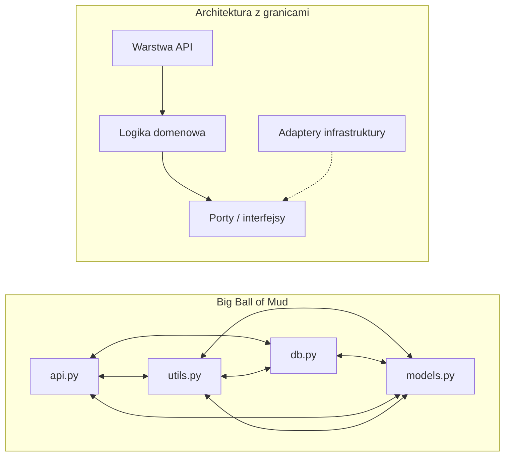
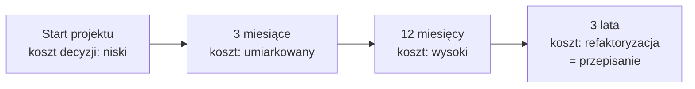
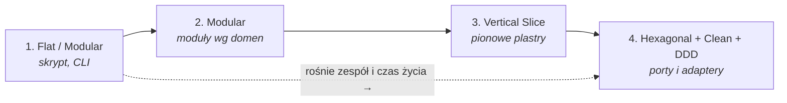
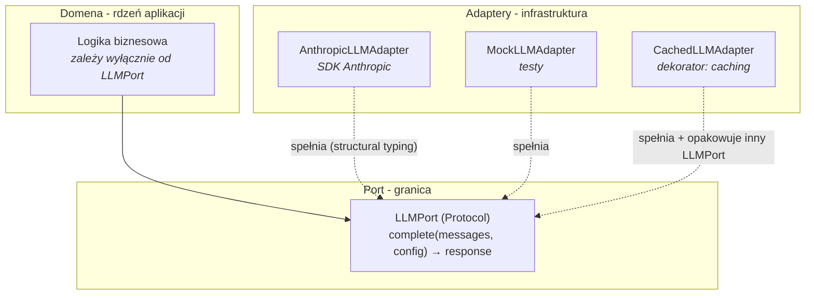

# 7. Architektura Aplikacji i Dobre Praktyki

> [!NOTE]
> Twoje doświadczenie z C++, C# czy Javy oznacza, że pojęcia takie jak warstwy, granice modułów, odwrócenie zależności (*dependency inversion*) czy wzorce projektowe nie są dla Ciebie nowe. Ten rozdział nie uczy architektury od zera - pokazuje, **jak te uniwersalne idee mają się do realiów ekosystemu Pythona**: jego dynamicznej natury, kultury "explicit is better than implicit" i specyfiki projektów Data Science / GenAI, gdzie zależności zewnętrzne (SDK dostawców LLM, frameworki ML) zmieniają się z miesiąca na miesiąc.

## Czym jest - i czym nie jest - architektura

Architektura aplikacji to **nie diagram UML** wiszący w firmowej Wiki ani folder `docs/` z nieaktualnymi schematami. Architektura to **zbiór świadomych decyzji o granicach**:

* Kto może importować kogo? (kierunek zależności)
* Gdzie żyje logika biznesowa, a gdzie kod infrastrukturalny?
* Które elementy systemu wolno wymieniać niezależnie od pozostałych?
* Jak zlokalizowana jest zmiana funkcjonalna - dotyka jednego miejsca czy dziesięciu?

Kluczowa obserwacja: **jeśli nie podejmiesz tych decyzji świadomie, podejmie je za Ciebie przypadek.** A decyzja domyślna w projekcie bez architektury jest zawsze ta sama - **Big Ball of Mud** (wielka kula błota): kod bez wyraźnej struktury, w którym każdy moduł zależy od każdego innego, logika biznesowa jest rozsmarowana po kontrolerach, helperach i skryptach, a próba zmiany w jednym miejscu rozjeżdża trzy inne.



Big Ball of Mud nie powstaje przez czyjąś niekompetencję. Powstaje przez **akumulację rozsądnych skrótów pod presją czasu** - każdy `import` "na szybko" jest lokalnie racjonalny, a suma tych decyzji to chaos. Architektura jest mechanizmem, który czyni te skróty widocznymi i - gdy trzeba - niemożliwymi.

### "Architektura jest tylko dla korporacji" - najdroższy mit

Częsty zarzut: po co architektura w trzyosobowym zespole albo w projekcie, który "i tak za pół roku przepiszemy"? Problem w tym, że **koszt braku architektury nie jest stały - rośnie wykładniczo z czasem życia projektu**.



Na starcie projektu wprowadzenie granic kosztuje kilka godzin namysłu i parę plików `__init__.py`. Po dwóch latach ta sama zmiana to wielotygodniowa refaktoryzacja, bo wszystko zależy od wszystkiego. **Najtaniej jest podjąć decyzje architektoniczne, gdy projekt jest jeszcze mały** - paradoksalnie wtedy, gdy wydają się najmniej potrzebne.

> [!IMPORTANT]
> Architektura to nie inwestycja "na wszelki wypadek" - to ubezpieczenie od kosztu zmiany. Pytanie nie brzmi "czy nas na to stać", lecz "ile czasu projekt będzie żył". Skrypt jednorazowy nie potrzebuje architektury. System, który ma być rozwijany przez lata przez zmieniający się zespół - potrzebuje jej od pierwszego dnia.

## Cztery topologie architektoniczne

Nie istnieje "jedna dobra architektura". Istnieje **dobór topologii do skali zespołu i projektu**. Wdrożenie Hexagonal Architecture z pełnym DDD w trzyosobowym zespole budującym MVP to klasyczny *overengineering* - płacisz koszt złożoności, zanim pojawi się problem, który ta złożoność rozwiązuje. Z drugiej strony utrzymywanie płaskiej struktury w systemie rozwijanym przez pięć zespołów to gwarancja Big Ball of Mud.

Poniżej cztery topologie uszeregowane według rosnącej złożoności. Traktuj je jako **kontinuum, po którym projekt się przesuwa**, a nie jako rozłączne kategorie.

| Topologia | Zasada organizacji | Skala zespołu | Skala projektu | Kiedy stosować |
| :--- | :--- | :--- | :--- | :--- |
| **Flat / Modular** | Wszystko w jednym pakiecie, ewentualnie kilka plików | 1 osoba | Skrypt, narzędzie CLI, notebook produkcyjny | Kod krótko żyjący, jednorazowy lub bardzo mały; gdy struktura kosztowałaby więcej, niż daje |
| **Modular** | Podział na moduły wg domen, jeden deployment | 1–5 osób | Mała/średnia aplikacja, pojedyncza usługa | Domyślny wybór dla większości projektów produkcyjnych na starcie |
| **Vertical Slice** | Kod organizowany w pionowe "plastry" funkcjonalności | 3–10 osób | Średnia aplikacja, serwis z wieloma feature'ami | Gdy zespół rośnie i zależy Ci na lokalizacji zmian per-feature |
| **Hexagonal + Clean + DDD** | Pełna separacja domeny od infrastruktury, jawne porty i adaptery | 10+ osób, wiele zespołów | Duży, długo żyjący system, krytyczna domena | Złożona logika biznesowa, długi horyzont życia, wiele integracji zewnętrznych |



> [!TIP]
> Nie zaczynaj od topologii 4, "bo kiedyś urośnie". Zacznij od najprostszej topologii, która rozwiązuje Twój dzisiejszy problem, i **migruj w górę, gdy ból staje się realny** - gdy widać, że feature'y wzajemnie się blokują, gdy onboarding nowej osoby trwa tygodnie, gdy zmiana modelu LLM wymaga dotknięcia połowy kodu. Migracja w górę z dobrze zmodularyzowanego kodu jest tania. Migracja z Big Ball of Mud - nie.

## Dziel kod według domeny, nie według warstw

Najczęstszy błąd organizacyjny w projektach Python (i nie tylko) to **podział wg warstw technicznych**: osobny katalog na modele, osobny na serwisy, osobny na repozytoria. Wygląda schludnie, jest intuicyjny - i jest pułapką.

```text
# ŹLE - podział wg warstw technicznych
src/
  models/
    user.py
    order.py
    payment.py
  services/
    user_service.py
    order_service.py
    payment_service.py
  repositories/
    user_repo.py
    order_repo.py

# DOBRZE - podział wg domen biznesowych
src/
  users/
    models.py
    service.py
    repository.py
  orders/
    models.py
    service.py
    repository.py
  payments/
    models.py
    service.py
```

Dlaczego podział warstwowy zawodzi? Bo **funkcjonalność biznesowa jest pionowa, a warstwy są poziome**. Gdy dodajesz pole do zamówienia, zmiana dotyka `models/order.py`, `services/order_service.py` i `repositories/order_repo.py` - trzech katalogów. Jednocześnie kod zamówień i kod płatności leżą obok siebie w `services/`, mimo że to dwie różne domeny, które nie powinny o sobie wiedzieć zbyt wiele.

Podział domenowy **lokalizuje zmianę**: cała logika zamówień żyje w `src/orders/`. Otwierasz jeden katalog, widzisz całą funkcjonalność, a granica między `orders/` a `payments/` jest fizycznie widoczna w drzewie katalogów. To także naturalna granica dla testów architektury (patrz dalej) i dla podziału pracy w zespole.

> [!NOTE]
> Reguła praktyczna: **katalog powinien odpowiadać na pytanie "co to robi", a nie "czym to jest technicznie".** `orders/` mówi *co* (obsługa zamówień). `services/` mówi *czym* (to są serwisy) - i to jest właśnie informacja bezużyteczna dla kogoś, kto szuka miejsca na zmianę. Warstwa techniczna to szczegół, który powinien być widoczny dopiero *wewnątrz* modułu domenowego.

## Vertical Slice Architecture

Gdy projekt rośnie, naturalnym kolejnym krokiem jest **Vertical Slice Architecture** - doprowadzenie podziału domenowego do poziomu pojedynczego *feature'a*. Każdy plaster (*slice*) to kompletna, pionowa funkcjonalność: ma własne API, własną logikę (*handler*) i własne modele. Plaster jest na tyle samowystarczalny, że można go zrozumieć, przetestować i zmienić, nie wychodząc poza jego folder.

```text
order_service/
  shared/            # współdzielone: db, config, auth
  features/
    create_order/
      router.py
      handler.py
      models.py
    cancel_order/
      router.py
      handler.py
      models.py
```

Zalety tego podejścia są bezpośrednią konsekwencją tego, że **plaster jest jednostką zmiany**: nowy feature to nowy katalog (a nie edycja pięciu istniejących plików warstwowych), dwie osoby pracujące nad różnymi feature'ami niemal nie wchodzą sobie w drogę, a usunięcie funkcjonalności sprowadza się do skasowania folderu. Każdy plaster może też - jeśli trzeba - mieć własny styl: jeden feature jest trywialny i nie potrzebuje warstwy repozytorium, inny jest złożony i wprowadza ją u siebie. Nie narzucasz jednej struktury całemu systemowi.

> [!WARNING]
> Katalog `shared/` to **potencjalny god-module**. To naturalne miejsce na rzeczy faktycznie współdzielone - połączenie z bazą, konfigurację, uwierzytelnianie. Ale `shared/` ma tendencję do puchnięcia: ląduje tam wszystko, co "pasuje do więcej niż jednego feature'a", aż staje się ukrytym Big Ball of Mud, od którego zależy cały system. **Rozrastający się `shared/` to sygnał, że granice feature'ów są źle wytyczone** - być może dwa feature'y to w istocie jeden, albo część `shared/` to osobna domena, która zasługuje na własny moduł. Traktuj rozmiar `shared/` jak metrykę: jeśli rośnie szybciej niż reszta systemu, zatrzymaj się i przemyśl podział.

## Rich vs Anemic Domain Model

Drugie kluczowe pytanie architektoniczne: **gdzie żyje logika biznesowa?** Tu Python - z jego dynamiczną naturą i kulturą Pydantic/dataclass - szczególnie kusi do antywzorca.

### Anemic Domain Model - antywzorzec

W **Anemic Domain Model** (anemiczny model domenowy) klasy domenowe to puste worki danych - zawierają wyłącznie pola, bez zachowania. Cała logika biznesowa wycieka do "serwisów", które operują na tych biernych strukturach z zewnątrz.

```python
class UserRequest(BaseModel):
    name: str
    email: str
    age: int
```

Taki model jest w porządku jako **DTO** - obiekt transportowy na granicy systemu (np. payload żądania HTTP walidowany przez Pydantic, dokładnie jak w rozdziale [4. Web Development](./04-web-development.md)). Problem zaczyna się, gdy *cała* domena wygląda w ten sposób, a reguły biznesowe ("zamówienia wysłanego nie wolno anulować", "rabat nie może przekroczyć 50%") żyją w odległych funkcjach `*_service.py`. Skutek: ta sama reguła bywa zaimplementowana w trzech miejscach, niespójnie; nie da się stworzyć obiektu w niepoprawnym stanie i temu zapobiec; logika domenowa jest nieodróżnialna od kodu sklejającego (*glue code*).

### Rich Domain Model

W **Rich Domain Model** (bogaty model domenowy) zachowanie żyje tam, gdzie dane. Obiekt sam pilnuje swoich niezmienników (*invariants*) i sam wykonuje operacje na sobie.

```python
@dataclass
class Order:
    items: list[OrderItem]
    status: OrderStatus

    def cancel(self) -> None:
        if self.is_shipped():
            raise OrderError("Cannot cancel a shipped order")
        self.status = OrderStatus.CANCELLED

    def total(self) -> Decimal:
        return sum(item.price * item.quantity for item in self.items)

    def is_shipped(self) -> bool:
        return self.status == OrderStatus.SHIPPED
```

Tu reguła "nie anuluj wysłanego zamówienia" jest **jedna i nie do obejścia** - żyje w metodzie `cancel()`. Nie da się anulować zamówienia, omijając tę regułę, bo nie ma innej drogi do zmiany statusu. Obliczenie `total()` jest blisko danych, na których operuje. Klasa jest **samodokumentująca**: czytając `Order`, widzisz, co zamówienie potrafi i jakie ma ograniczenia.

> [!TIP]
> Praktyczny podział w aplikacji Python/FastAPI: **modele Pydantic na granicach** (walidacja wejścia/wyjścia API - anemiczne z założenia, to ich rola) i **bogate modele domenowe wewnątrz** (`dataclass` lub zwykłe klasy z zachowaniem). Na granicy mapujesz jedno na drugie. To rozdziela "kształt danych przesyłanych po sieci" od "reguł, które rządzą domeną" - dwie rzeczy, które zmieniają się z różnych powodów i w różnym tempie.

## Ports & Adapters w praktyce GenAI

Wzorzec **Ports & Adapters** (znany też jako Hexagonal Architecture) jest sercem topologii 4 - i jest *szczególnie* wartościowy w aplikacjach GenAI. Powód jest praktyczny: dostawcy LLM i ich SDK zmieniają się ekstremalnie szybko, a Ty nie chcesz, by zmiana modelu pociągała za sobą przepisywanie logiki aplikacji.

Idea jest prosta: **domena definiuje interfejs (port), którego potrzebuje; infrastruktura dostarcza implementację (adapter)**. Zależność jest odwrócona - kod domenowy nie wie nic o konkretnym SDK; wie tylko o własnym porcie.

### Protocol zamiast ABC - structural typing (PEP 544)

W Pythonie port można zdefiniować na dwa sposoby: przez `abc.ABC` (klasa abstrakcyjna) albo przez `typing.Protocol` (PEP 544[^pep544]). **Dla portów rekomendujemy `Protocol`.**

| Cecha | `abc.ABC` | `typing.Protocol` |
| :--- | :--- | :--- |
| Typ zgodności | Nominalna - adapter musi *dziedziczyć* po klasie | Strukturalna - wystarczy, że adapter *ma pasujące metody* |
| Zależność adapter → port | Adapter musi importować port | Adapter nie musi znać ani importować portu |
| Weryfikacja | W czasie definicji klasy | Statycznie przez `mypy`, opcjonalnie w runtime |
| Pasuje do | Hierarchii dziedziczenia | Granic między modułami / odwrócenia zależności |

`Protocol` to **duck typing weryfikowane statycznie**: jeśli obiekt ma metodę o właściwej sygnaturze, *jest* implementacją portu - niezależnie od tego, po czym dziedziczy. Kluczowa konsekwencja architektoniczna: **adapter nie musi importować portu**. Dzięki temu kierunek zależności jest czysty - to domena "posiada" definicję portu, a infrastruktura jedynie przypadkiem do niego pasuje. Z `abc.ABC` adapter musiałby `from domain.ports import LLMPort`, co tworzy zależność infrastruktury od domeny zapisaną wprost w kodzie.

### Pełny przykład: `LLMPort`

Poniższy przykład pokazuje, jak odseparować kod domenowy od konkretnego SDK dostawcy LLM.

```python
from dataclasses import dataclass
from typing import Protocol, runtime_checkable
from functools import lru_cache

@dataclass
class LLMMessage:
    role: str
    content: str

@dataclass
class LLMConfig:
    model: str
    temperature: float = 0.7
    max_tokens: int = 1024

@dataclass
class LLMResponse:
    content: str
    tokens_used: int

@runtime_checkable
class LLMPort(Protocol):
    async def complete(
        self, messages: list[LLMMessage], config: LLMConfig
    ) -> LLMResponse:
        ...

class AnthropicLLMAdapter:
    async def complete(
        self, messages: list[LLMMessage], config: LLMConfig
    ) -> LLMResponse:
        # wywołanie SDK Anthropic, mapowanie typów
        ...

class MockLLMAdapter:
    async def complete(
        self, messages: list[LLMMessage], config: LLMConfig
    ) -> LLMResponse:
        return LLMResponse(content="mock", tokens_used=0)

class CachedLLMAdapter:
    def __init__(self, inner: LLMPort) -> None:
        self._inner = inner
    async def complete(
        self, messages: list[LLMMessage], config: LLMConfig
    ) -> LLMResponse:
        # sprawdź cache, w razie miss deleguj do self._inner
        ...

@lru_cache
def get_llm(provider: str) -> LLMPort:
    match provider:
        case "anthropic":
            return CachedLLMAdapter(AnthropicLLMAdapter())
        case "mock":
            return MockLLMAdapter()
        case _:
            raise ValueError(f"Unknown provider: {provider}")
```

Warto zwrócić uwagę na kilka rzeczy:

* **Domena zależy tylko od `LLMPort`** - nigdy od `anthropic`, `openai` czy żadnego konkretnego SDK. Własne typy `LLMMessage`, `LLMConfig`, `LLMResponse` są "lingua franca" domeny; mapowanie na typy SDK dzieje się *wyłącznie* wewnątrz adaptera. Gdy dostawca zmieni API albo zdecydujesz się na innego, dotykasz jednego pliku.
* **Adaptery stackują się jak dekoratory.** `CachedLLMAdapter` przyjmuje w konstruktorze dowolny `LLMPort` i sam jest `LLMPort`-em. Możesz więc składać warstwy: caching opakowujący retry opakowujący właściwy adapter - bez modyfikacji żadnej z warstw. To wzorzec Decorator zrealizowany na poziomie portu.
* **`MockLLMAdapter` daje testowalność.** Testy logiki domenowej nie wykonują wywołań sieciowych, są deterministyczne i szybkie. To rozwiązuje konkretny ból aplikacji GenAI - testowanie kodu, który zależy od niedeterministycznego, płatnego, wolnego API.
* **`get_llm` jest *composition root*** - jedynym miejscem, gdzie zapadają decyzje o konkretnych implementacjach. `@lru_cache` zapewnia, że dla danego providera dostajesz jedną instancję (efekt singletona). Reszta aplikacji dostaje `LLMPort` przez wstrzykiwanie zależności i nie wie, co kryje się pod spodem.



Diagram pokazuje istotę wzorca: **wszystkie strzałki zależności wskazują do środka.** Domena jest w rdzeniu i nie wie nic o świecie zewnętrznym. Port jest granicą. Adaptery są na zewnątrz i to one "sięgają" do portu - nigdy odwrotnie. To właśnie *odwrócenie zależności* (Dependency Inversion) w czystej postaci.

> [!TIP]
> Ten wzorzec jest szczególnie cenny w aplikacjach GenAI. Jak opisano w rozdziale [6. Aplikacje GenAI i RAG](./06-generative-ai-and-rag.md), krajobraz modeli zmienia się z tygodnia na tydzień, a SDK dostawców (OpenAI, Anthropic, Google) mają różne, niekompatybilne API. Jeśli logika Twojej aplikacji zależy od `LLMPort`, a nie od `anthropic.AsyncAnthropic`, to wymiana modelu czy dostawcy - albo dołożenie wariantu lokalnego, open-weight - jest zmianą jednego adaptera, nie przepisaniem systemu. To samo myślenie stoi za narzędziami typu **LiteLLM** i za protokołem **MCP** opisanymi w rozdziale 6: oba są w istocie gotowymi realizacjami idei portu.

## Egzekwowanie granic - testy architektury

Granice architektoniczne mają jedną nieprzyjemną właściwość: **erodują**. Reguła "feature nie importuje innego feature'a" obowiązuje dokładnie do pierwszego pull requesta, w którym ktoś pod presją deadline'u doda "tymczasowy" import - a recenzent go przeoczy. Po pół roku takich PR-ów Twoja Vertical Slice Architecture jest znów Big Ball of Mud, tylko z ładnymi nazwami katalogów.

Rozwiązanie: **granice, które nie są egzekwowane automatycznie, nie istnieją.** Reguły architektoniczne trzeba zapisać jako **testy** i uruchamiać w CI - wtedy naruszenie granicy psuje build, a nie czeka na uważność recenzenta. W ekosystemie Python służy do tego m.in. [`pytest-archon`](https://github.com/jwbargsten/pytest-archon)[^archon] (odpowiednik [ArchUnit](https://archunit.org/) z Javy).

```python
def test_features_dont_import_from_each_other():
    # żaden feature nie importuje z innego feature
    ...

def test_domain_doesnt_import_infrastructure():
    # warstwa domeny nie zależy od infrastruktury
    ...
```

Takie testy kodyfikują dokładnie te decyzje, które omawialiśmy wyżej:

* `test_features_dont_import_from_each_other` pilnuje izolacji plastrów z Vertical Slice - `create_order` nie sięga do `cancel_order`. Komunikacja między feature'ami, jeśli jest potrzebna, idzie przez `shared/` albo przez jawny mechanizm (zdarzenia, wspólny port).
* `test_domain_doesnt_import_infrastructure` pilnuje wzorca Ports & Adapters - kod domenowy nie zawiera `import anthropic` ani `import sqlalchemy`. Jeśli ktoś spróbuje skrótu, test to wychwyci.

> [!IMPORTANT]
> Test architektury to **jedyny artefakt, który nie pozwala dokumentacji architektonicznej się zdezaktualizować.** Diagram w Wiki kłamie po trzech miesiącach. Test architektury albo przechodzi (granica trzyma się), albo nie przechodzi (granica naruszona) - nie ma stanu pośredniego, nie ma "prawie aktualnego". Dodaj te testy do CI od pierwszego dnia, gdy wprowadzasz granice.

## Dokumentowanie decyzji - ADR

Architektura to ciąg decyzji. Decyzja podjęta, ale nieudokumentowana, jest po roku **nieodróżnialna od przypadku** - nikt nie wie, czy "używamy `Protocol` zamiast `ABC`" to świadomy wybór z uzasadnieniem, czy ktoś tak po prostu napisał. Gdy zmienia się zespół, ta wiedza znika całkowicie.

Rozwiązaniem są **ADR (Architecture Decision Records)** - krótkie, wersjonowane dokumenty (zwykle w `docs/adr/` w repozytorium, obok kodu), z których każdy opisuje jedną decyzję: jej kontekst, samą decyzję i jej konsekwencje. ADR jest **niezmienny** - gdy decyzja się zmienia, nie edytujesz starego ADR, tylko piszesz nowy, który "supersedes" poprzedni. Dzięki temu masz nie tylko stan obecny, ale i *historię rozumowania*.

```text
# ADR-014: Użycie Protocol zamiast ABC dla portów

## Status: Zaakceptowany

## Kontekst
Potrzebujemy definiować interfejsy dla adapterów zewnętrznych...

## Decyzja
Używamy typing.Protocol zamiast abc.ABC...

## Konsekwencje
+ Brak wymuszonego dziedziczenia, łatwiejsze testy
+ Structural typing - adapter nie musi znać portu
- runtime_checkable sprawdza tylko istnienie metod, nie sygnatury
```

Zwróć uwagę na sekcję **Konsekwencje** - dobry ADR uczciwie wymienia także *minusy* decyzji. To ona odróżnia ADR od marketingu: kolejny inżynier czytający `ADR-014` wie, że `runtime_checkable` jest mechanizmem ograniczonym (sprawdza istnienie metod, nie ich sygnatury), i nie potraktuje go jak pełnej walidacji. ADR nie ma przekonywać, że decyzja była idealna - ma pokazać, że była **świadoma**, i dać następnym osobom materiał do jej rewizji.

> [!TIP]
> Zacznij prowadzić ADR-y od pierwszej nietrywialnej decyzji. Nie dokumentuj rzeczy oczywistych ("używamy Pythona"). Dokumentuj wybory, które ktoś rozsądny mógłby zakwestionować: wybór topologii architektonicznej, decyzję `Protocol` vs `ABC`, wybór bazy wektorowej, sposób obsługi niedeterministyczności LLM. Numeruj sekwencyjnie (`ADR-001`, `ADR-002`, ...) i nigdy nie usuwaj starych - co najwyżej oznaczaj jako `Wycofany` lub `Zastąpiony przez ADR-NNN`.

> [!NOTE]
> **Mikroserwisy vs monolit a rozmiar zespołu.** Prawo Conwaya tłumaczy, dlaczego narzucenie mikroserwisów małemu zespołowi (3–5 osób) kończy się „rozproszonym monolitem" — komunikacja między serwisami kosztuje, a mały zespół i tak komunikuje się swobodnie. Dla takich zespołów modularny monolit (topologia 2 lub 3) jest zwykle lepszym wyborem. Mikroserwisy zaczynają mieć sens, gdy zespołów jest wiele i komunikacja między nimi wymaga formalnych granic.

## Prawo Conwaya

Na koniec obserwacja, która tłumaczy, dlaczego architektura tak często "nie wychodzi" mimo dobrych intencji. **Prawo Conwaya** głosi:

> Organizacje projektują systemy, które są kopią struktury komunikacyjnej tej organizacji.[^conway]

Innymi słowy: jeśli masz cztery zespoły, prędzej czy później powstaną cztery komponenty (albo cztery usługi) - niezależnie od tego, co mówi diagram architektury. Jeśli dwa zespoły rzadko ze sobą rozmawiają, granica między ich kodem będzie ostra; jeśli wszyscy siedzą w jednym pokoju i gadają non stop, kod zleje się w monolit. **Struktura systemu odzwierciedla strukturę komunikacji ludzi, którzy go budują.**

Praktyczny wniosek to **Inverse Conway Maneuver** (odwrotny manewr Conwaya): zamiast walczyć z prawem Conwaya, **wykorzystaj je celowo**. Jeśli chcesz architektury z trzema niezależnymi, luźno powiązanymi modułami - uformuj trzy niezależne, luźno powiązane zespoły, każdy odpowiedzialny za jeden moduł. Struktura organizacji *wymusi* wtedy pożądaną strukturę kodu. Architektura nie jest więc wyłącznie decyzją techniczną - jest też **decyzją o tym, jak zorganizować ludzi**.

> [!NOTE]
> Konsekwencja dla małego zespołu: w trzyosobowym zespole, gdzie wszyscy o wszystkim wiedzą, prawo Conwaya naturalnie ciągnie w stronę monolitu z miękkimi granicami - i to jest *w porządku* dla tej skali (topologia 2 z tabeli). Próba narzucenia mikrousług trzem osobom siedzącym obok siebie to walka z Conwayem, którą zwykle się przegrywa. Architektura, zespół i skala muszą do siebie pasować.

## Dalsze materiały

* **Model C4** - notacja do diagramowania architektury na czterech poziomach abstrakcji: **Context** (system w otoczeniu), **Container** (aplikacje, bazy, usługi), **Component** (moduły wewnątrz kontenera) i **Code** (klasy). Pozwala rozmawiać o architekturze na właściwym poziomie szczegółowości dla danego odbiorcy - bez tonięcia w detalu. Świetnie uzupełnia diagramy Mermaid używane w tym przewodniku. Zob. [c4model.com](https://c4model.com/).[^c4]
* **12-Factor App** - zbiór dwunastu zasad budowy aplikacji cloud-native: m.in. konfiguracja w zmiennych środowiskowych, bezstanowe procesy, jawne deklarowanie zależności, równoważność środowisk dev/prod. To zasady *operacyjne*, ortogonalne do topologii z tego rozdziału - stosują się do każdej z czterech. Zob. [12factor.net](https://12factor.net/).[^twelvefactor]
* **User stories jako źródło granic** - dobrze sformułowane *user stories* ("jako X chcę Y, aby Z") są naturalnym punktem wyjścia do wytyczania granic feature'ów w Vertical Slice Architecture: jedna spójna historia użytkownika to często jeden plaster. Granice domenowe rzadko wymyśla się przy tablicy - wyłaniają się z języka, którym o systemie mówi biznes (to także rdzeń **DDD** i koncepcji *ubiquitous language*).
* **Pojęcia** - definicje terminów użytych w tym rozdziale (DTO, Dependency Inversion, structural typing, composition root, ADR) znajdziesz w [słowniczku](./08-glossary.md).

> [!TIP]
> Jeśli z całego rozdziału masz zapamiętać jedną rzecz: **architektura to świadome decyzje o granicach, dobrane do skali, egzekwowane automatycznie i udokumentowane jako ADR.** Brak którejkolwiek z tych czterech cech - świadomości, dopasowania skali, egzekucji, dokumentacji - prowadzi tą samą drogą do Big Ball of Mud.

[^archon]: `pytest-archon` - wtyczka do `pytest` umożliwiająca pisanie testów reguł architektonicznych (dozwolone i zabronione zależności między modułami). Inspirowana biblioteką ArchUnit ze świata Javy.
[^conway]: Melvin E. Conway sformułował tę obserwację w artykule *"How Do Committees Invent?"* (1968). Stała się znana jako "Prawo Conwaya" po spopularyzowaniu przez Fredericka Brooksa w *The Mythical Man-Month*.
[^c4]: Model C4 został opracowany przez Simona Browna jako lekka, niezależna od narzędzi notacja do wizualizacji architektury oprogramowania.
[^twelvefactor]: Metodyka 12-Factor App została sformułowana przez zespół Heroku; mimo upływu lat pozostaje punktem odniesienia dla aplikacji uruchamianych w chmurze i kontenerach.
[^pep544]: PEP 544 — *Protocols: Structural subtyping (static duck typing)*. Zob. [peps.python.org/pep-0544](https://peps.python.org/pep-0544/).
